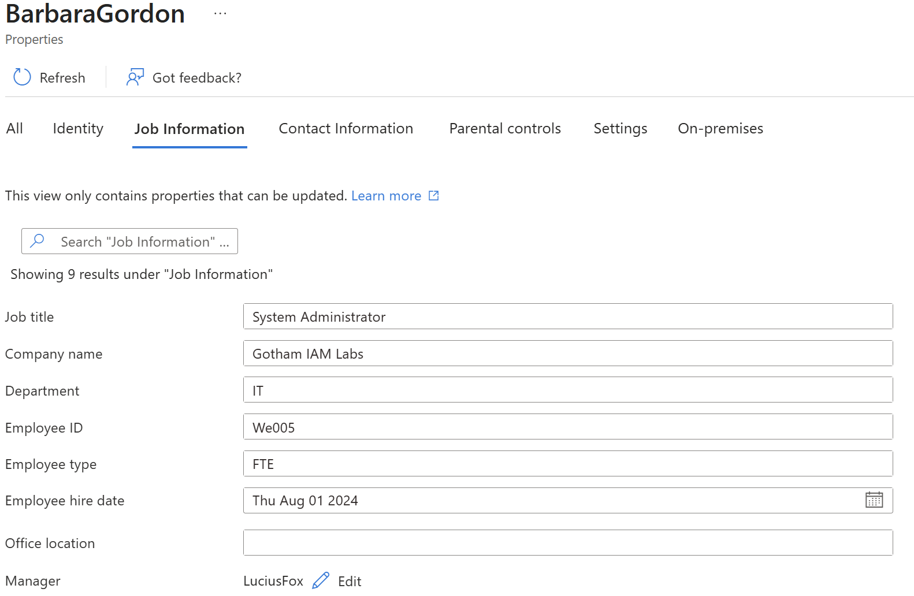
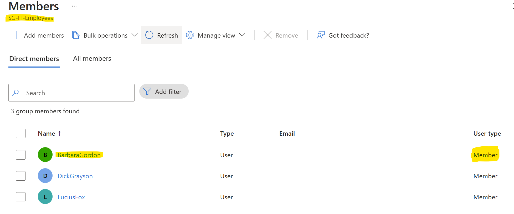
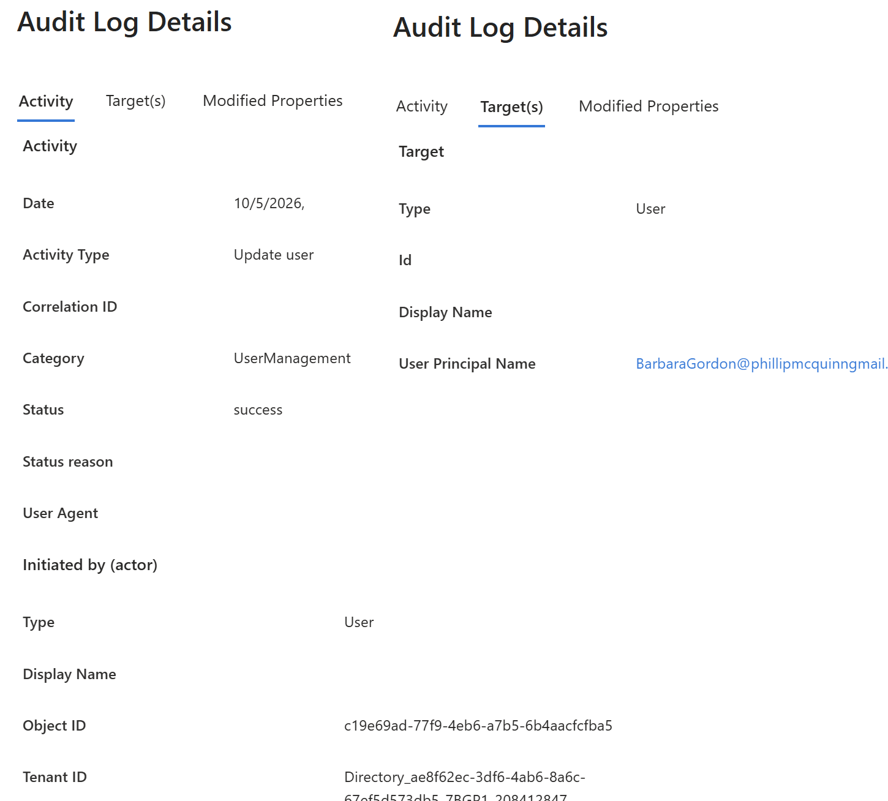
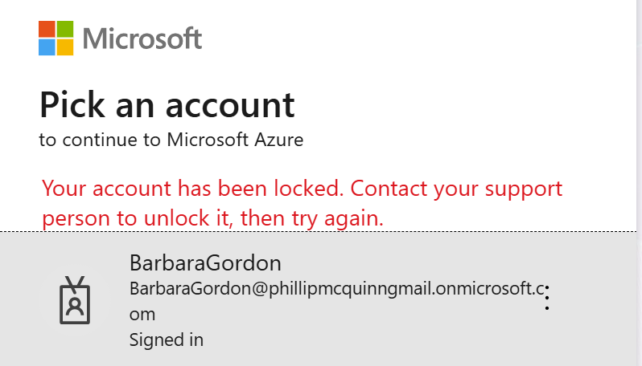
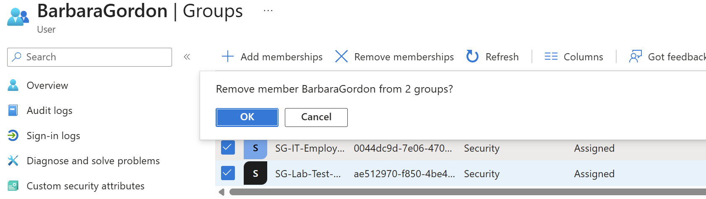
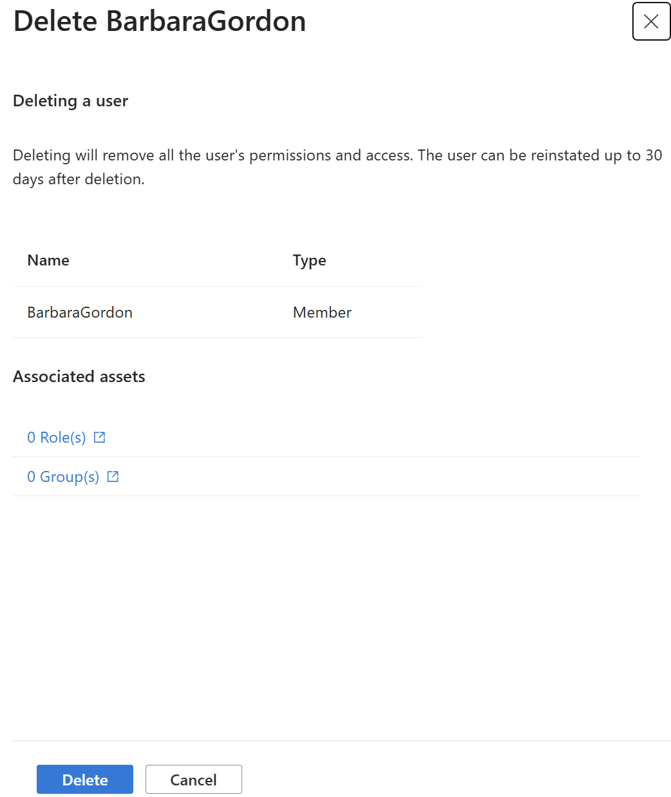

# Lab 01: Employee Onboarding and Offboarding

## Objective

Practice creating an employee account, assigning department group
membership, verifying access, and disabling access when employment ends.

## Status

Complete

## Employee Scenario

Barbara Gordon joins Gotham IAM Lab as a System Administrator.

| Attribute | Value |
|---|---|
| Display name | Barbara Gordon |
| Username | BarbaraGordon@phillipmcquinngmail.onmicrosoft.com |
| Job title | System ADministrator |
| Department | IT |
| Manager | Lucius Fox |
| Employee ID | WE005 |
| Hire date | Aug 1, 2024 |
| Department group | SG-IT-Employees |

## Prerequisites

Record the actual administrator role and license used:
- Administrator role: Global Admin
- License edition: Entra ID -Free

## Part 1: Onboarding

### 1. Create the employee account

User account created with "Users > All Users > New User"

### 2. Populate employee attributes

Set and verify:
- Job title
- Department
- Employee ID
- Hire date, if configured
- Manager

Evidence: 

### 3. Assign department membership

Add Barbara Gordon to SG-IT-Employees.
Verify the membership from the group or user record.

Evidence: 

### 4. Verify employee sign-in

Use a separate browser session to sign in as Barbara Gordon.
Complete any password-change or authentication prompts.

Record:
- Private browser opend, logged into entra.microsoft with test user.
-Prompted to change user password, and than set up Microsoft Authenticator. After set up, login was successful.

### 5. Review audit evidence

Locate the available audit events for account creation,
attribute changes, and group membership changes.

Evidence:

## Part 2: Offboarding

### 1. Record the starting state

Confirm that the employee account is enabled and list its
current group memberships.

### 2. Block sign-in

Block sign-in for the employee account.
Verify the account's disabled state.

Evidence: 

### 3. Revoke sessions

Revoke the employee's sign-in sessions.

Record when the action was performed and the behavior observed.
Do not assume every existing application session ends immediately.

### 4. Remove group memberships

Remove the employee from SG-IT-Employees and any other
groups assigned during this lab.

Verify that the memberships were removed.

Evidence:

## Cleanup

Record whether the account was:
- Retained in a disabled state
- Re-enabled for another lab
- Deleted after testing

Account was deleted for offboarding access

Evidence:

## Issues and Troubleshooting

no issues occurred during onboarding, testing, account manipulation, and offboarding

## Lessons Learned

Write what you observed, including:
- The main difference between blocking sign-in (for PTO or LoA)  verses revoking a session is the access the user has on the account.
                                                if an account is blocked the user must contact an admin to remove the block.
                                                if a users session gets revoked, they can login and reauthenticate to gain access.
- Audit logs are a great way to validate the success or failure of a change. System audit logs are a great way to track evidence of where the change came from, who made the change, and what occured.
