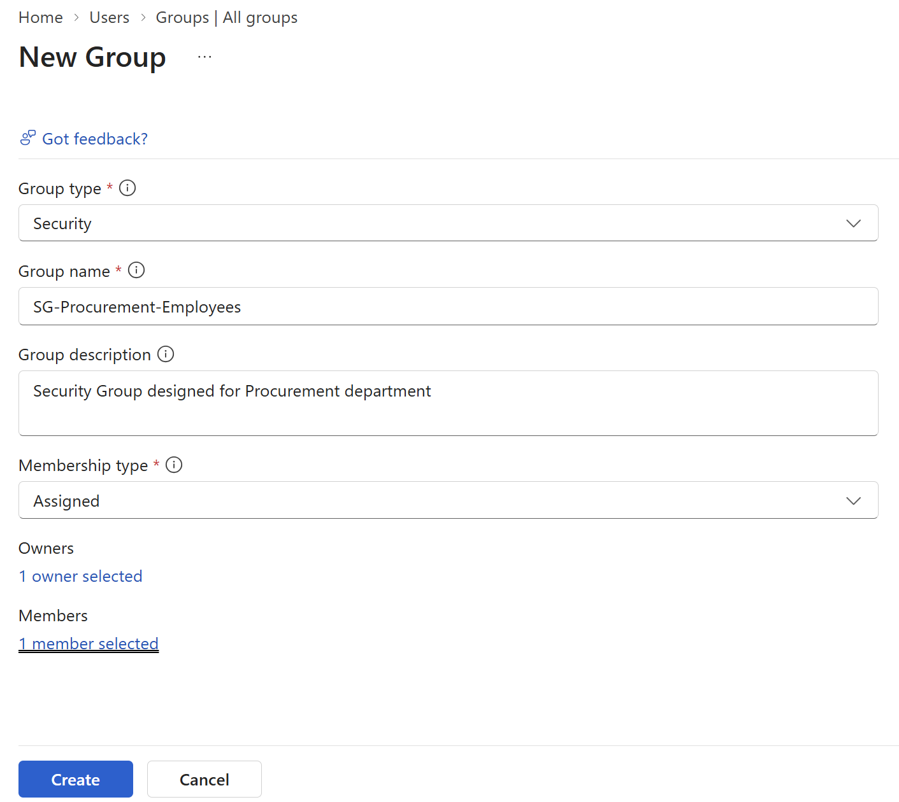
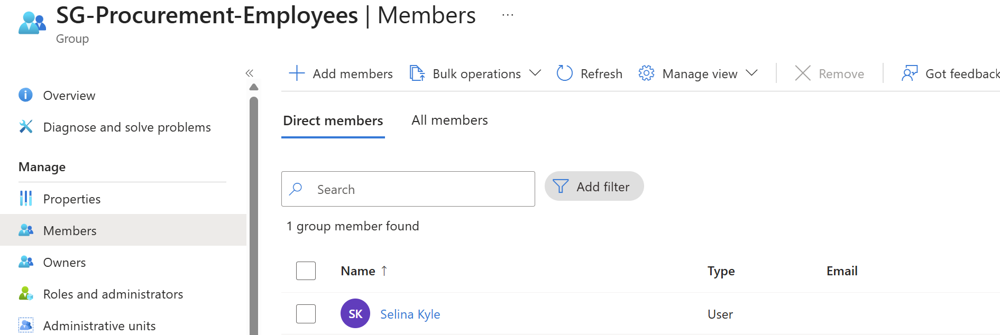
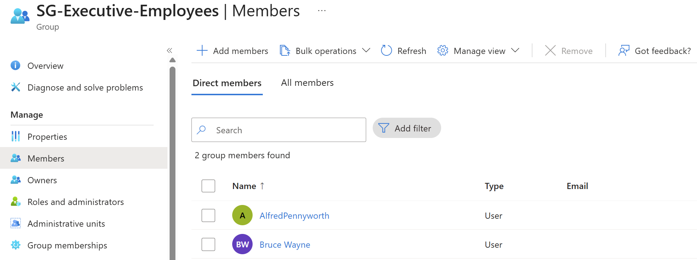
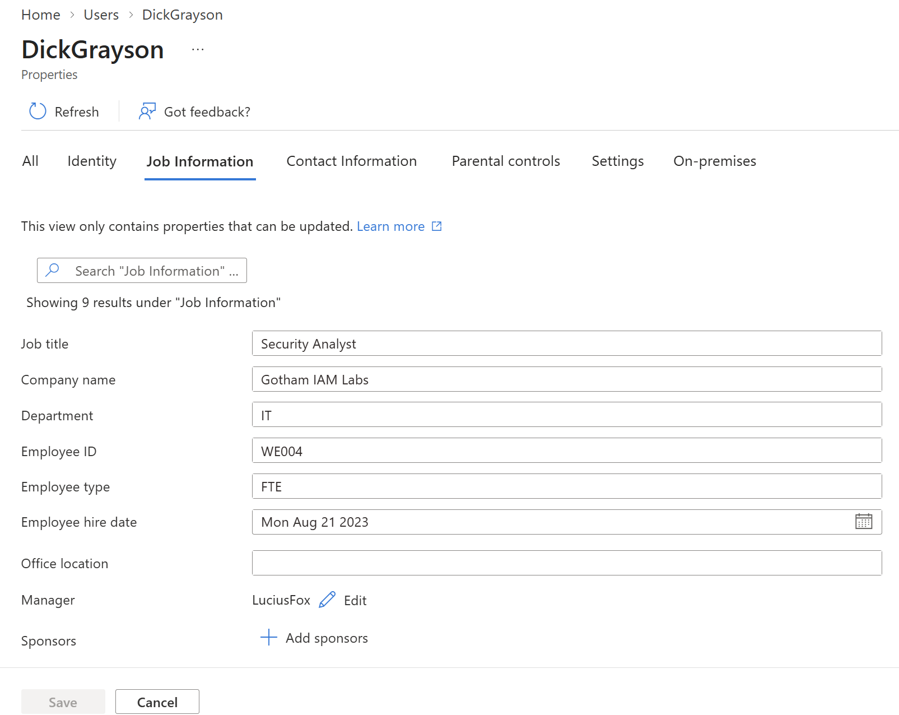
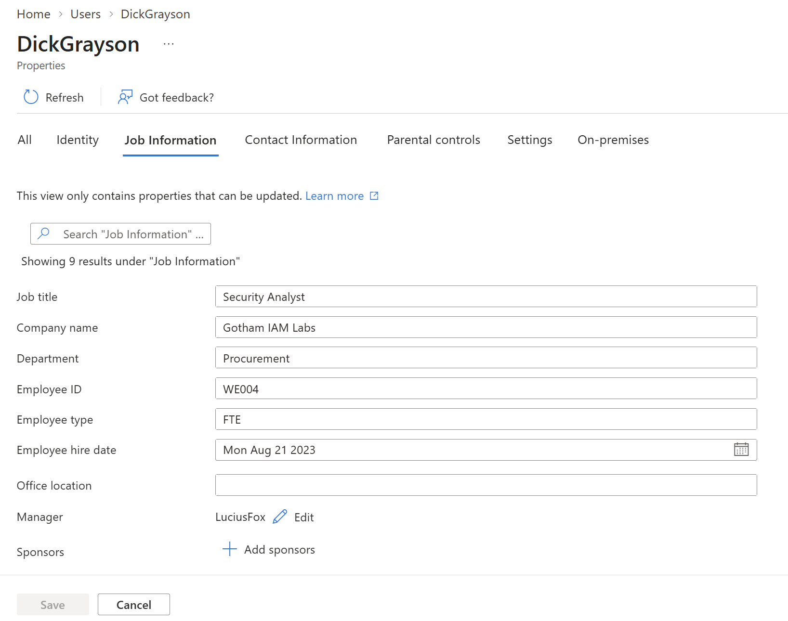
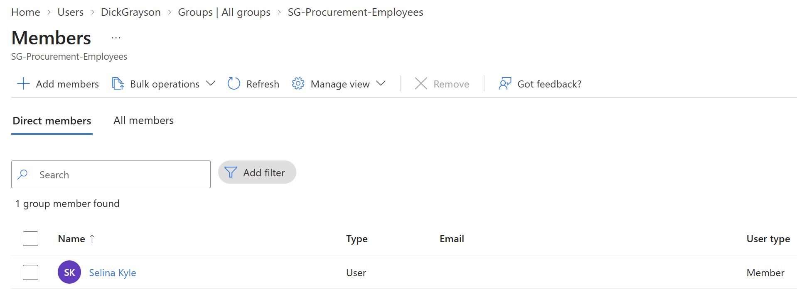
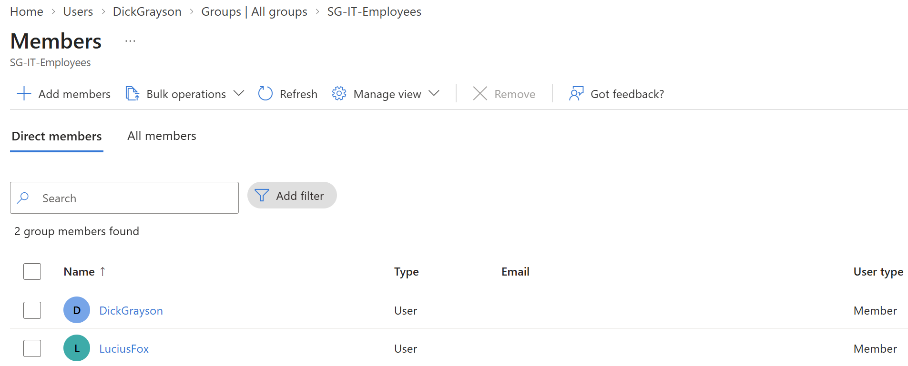
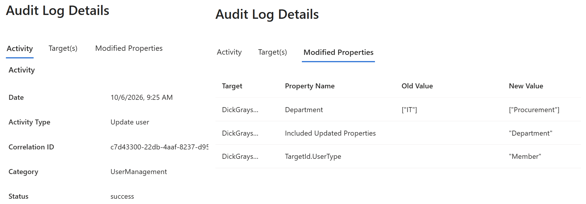
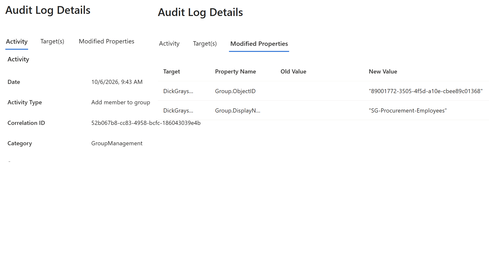

# Lab 02: Security Group Administration

## Objective

Practice creating department security groups, adding and removing
members, and verifying changes through membership records and audit logs.

## Status

Complete

## Environment

- Tenant: Gotham IAM Lab
- License: Free License
- Administrator role used: Global Admin
- Date performed: October 6, 2026

## Group Design

| Group name | Type | Membership type | Purpose |
|---|---|---|---|
| SG-Executive-Employees | Security | Assigned | Executive department employees |
| SG-IT-Employees | Security | Assigned | IT department employees |
| SG-Procurement-Employees | Security | Assigned | Procurement department employees |
| SG-Lab-Test-Users | Security | Assigned | Accounts used for lab testing |

These groups organize users for potential access assignments.
Membership alone does not grant access to an application.

## Planned Department Memberships

| User | Department group |
|---|---|
| Bruce Wayne | SG-Executive-Employees |
| Lucius Fox | SG-IT-Employees |
| Dick Grayson | SG-IT-Employees |
| Selina Kyle | SG-Procurement-Employees |

## Prerequisites

- Fictional employee accounts already exist.
- Administrator has permission to manage the selected groups.
- Existing group memberships have been recorded.

## Part 1: Create Security Groups

For each missing group:

1. Create a security group.
2. Enter its name and a description explaining its purpose.
3. Select Assigned membership.
4. Record the owner, if assigned.
5. Verify the group appears in the directory.

Evidence:

## Part 2: Add Members

1. Add each employee to the department group listed above.
2. Open each group's membership list.
3. Confirm the intended employees appear.
4. Check that unintended employees were not added.

Evidence:

## Part 3: Simulate a Department Transfer

Scenario:
Dick Grayson transfers from IT to Procurement.

1. Record his original department and group memberships.
2. Update his Department attribute to Procurement.
3. Check whether the assigned group membership changed automatically.
4. Remove him from SG-IT-Employees.
5. Add him to SG-Procurement-Employees.
6. Verify he belongs to Procurement and no longer belongs to IT.

Expected behavior:
Updating the Department attribute does not automatically change
membership in these Assigned groups.

Evidence:

## Part 4: Review Audit Logs

Locate the available events for group creation and membership changes.

Record:
- Date and time
- Activity
- Initiating account
- Target group or user
- Result

Evidence:

## Validation Results

| Test | Expected result | Actual result |
|---|---|---|
| Group creation | Groups exist with the intended settings | Group creation and adding members/owners works as expected. |
| Add members | Intended employees appear in their groups | Adding groups members display in the appropriate members section, they also show under the users profile group membership section. |
| Change department | Assigned memberships remain unchanged until manually edited | When changing a users department in their profile settings, it does not automatically edit the group assignments. |
| Remove IT membership | Dick no longer appears in the IT group | Removed user from the IT group. |
| Add Procurement membership | Dick appears in the Procurement group | Manually added user to Procurement group. |
| Audit review | Relevant group changes are recorded | Audit shows individual records of user group changes. |

## Troubleshooting

For each issue, record:
- Symptom
- Investigation
- Resolution
- Retest result

If no issues occurred, state that after completing the lab.

## Cleanup

Restore Dick Grayson to his original lab configuration:

- Department: IT
- Member of SG-IT-Employees
- Removed from SG-Procurement-Employees

Verify and document the restored state.

## Lessons Learned

Complete after testing:

- How Assigned group membership is managed.
Group membership is managed individually per user, not automatically after a department update in user profile.
- Why a department change requires a membership update.
Group memberships don't automatically update. If a user is transferred between departments, you must update users group enrollment to ensure they don't have access to incorrect department groups.
- How to verify both added and removed memberships.
you can validate user membership within audit logs "GroupManagement" log or see all groups a user belongs to within their profile "group membership".
- How audit logs support investigation of administrative changes.
Audit logs can show successful or failed changes. The logs will indicate who made the change, when it changed, and what changed.

Dick Grayson's account was reverted back to IT department, and correct group assignments were restored.
