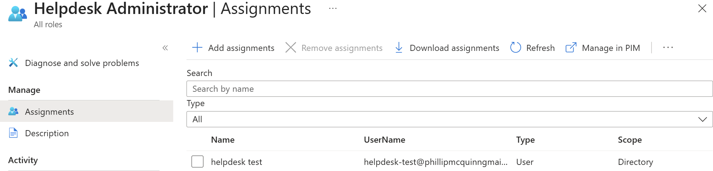
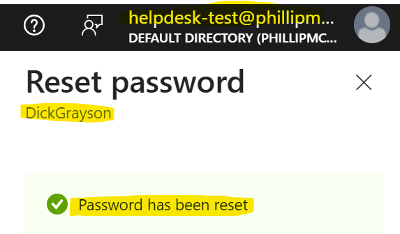
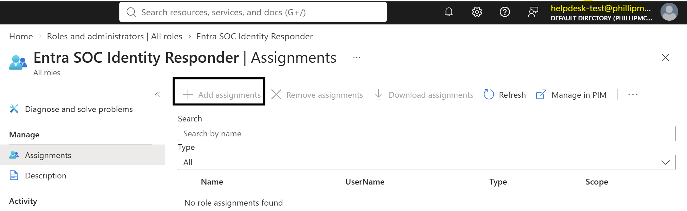
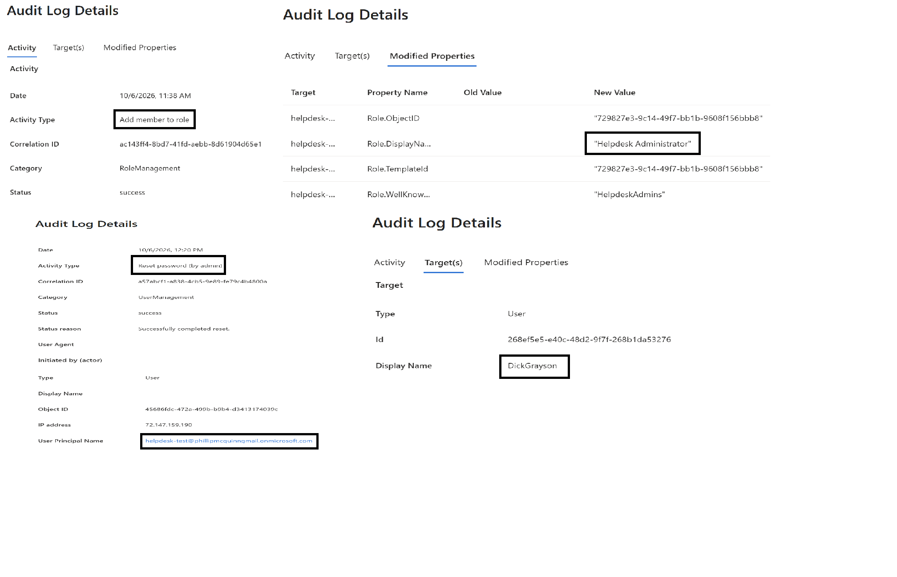
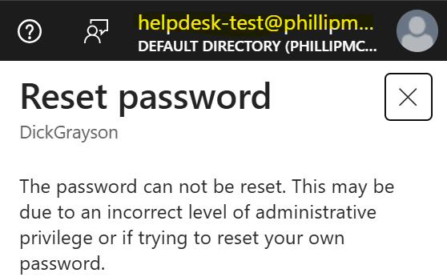

# Lab 03: Administrative Roles and Least Privilege

## Objective

Demonstrate Microsoft Entra ID role-based administrative access by temporarily assigning the **Helpdesk Administrator** role to a dedicated test account, testing a permitted password reset and a restricted administrator-role assignment, reviewing audit events, and verifying that administrative permissions are removed when the role is revoked.

## Status

**Completed — October 6, 2026.** The observed outcomes are summarized in the validation table below.

## Environment

| Setting | Value |
|---|---|
| Lab environment | Original Gotham IAM Lab (Microsoft Entra ID Free) |
| Tenant domain | `phillipmcquinngmail.onmicrosoft.com` |
| License | Microsoft Entra ID Free |
| Test administrator | `helpdesk-test` |
| Temporary role | Helpdesk Administrator |
| Assignment scope | Tenant |
| Target user | Dick Grayson — standard user without administrator roles |
| Test method | Separate administrator and employee browser sessions |

All user identities and the organization scenario are fictional. This lab was performed in the original Free tenant, not the later GothamLabz P2 tenant.

## Scenario

A help desk employee needs sufficient privileges to reset a standard user's password, without receiving broad tenant administration rights. A dedicated `helpdesk-test` account was temporarily assigned **Helpdesk Administrator** instead of **Global Administrator**. The lab tests both authorized and unauthorized actions, then removes the role and retests access.

## Prerequisites

- An existing `helpdesk-test` account and a standard user account for Dick Grayson.
- A separate administrator with permission to assign and remove Entra administrator roles.
- Separate authenticated browser sessions for the test administrator and employee.
- Access to Microsoft Entra role assignments and audit logs.

## Part 1: Select a Least-Privilege Administrator Role

The **Helpdesk Administrator** role was selected for the password-reset scenario because it supports help desk tasks for applicable non-administrative accounts without giving the test account full tenant control.

The role is **not** equivalent to Global Administrator and does not permit assignment of Microsoft Entra administrator roles. Password-reset privileges are subject to Microsoft's target-role and permission restrictions; the successful test in this lab was performed against a **standard user**. This lab did not test password resets against privileged administrator accounts or members of role-assignable groups.

**Reference:** [Microsoft Entra built-in role permissions](https://learn.microsoft.com/en-us/entra/identity/role-based-access-control/permissions-reference)

## Part 2: Assign Helpdesk Administrator

Using the role-assignment administrator, the **Helpdesk Administrator** role was assigned to `helpdesk-test` at tenant scope. The assignment appeared in the test account's **Assigned roles** view and within the role's **Assignments** list.

**Evidence:**

## Part 3: Validate an Allowed Action — Password Reset

Signed in as `helpdesk-test` in a separate browser session and successfully reset Dick Grayson's password. The generated temporary password was not included in the repository.

A separate sign-in as Dick Grayson confirmed that the temporary password worked. The user was prompted to change the password during sign-in, consistent with the observed password-reset workflow.

**Observed result:** A Helpdesk Administrator could reset the password of the tested standard user.

**Evidence:**

## Part 4: Validate a Restricted Action — Administrator Role Assignment

While signed in as `helpdesk-test`, attempted to access the administrator role-assignment action for another test account. The **Add assignments** control was grayed out, so the test administrator could not perform the action.

**Observed result:** The test account did not have permission to assign Microsoft Entra administrator roles. This was a disabled user-interface control, not an API-level permission-denied response.

**Evidence:**

## Part 5: Review Administrative Audit Events

Reviewed the available Microsoft Entra audit events using the main lab administrator. The records showed the temporary role being added and removed and the password-reset activity involving Dick Grayson's account.

The lab documentation records the presence of these audit events, but does not enumerate individual event timestamps or request IDs; no additional values are asserted here.

**Evidence:**

## Part 6: Remove the Role and Retest

Removed **Helpdesk Administrator** from `helpdesk-test` and confirmed that the account showed **zero assigned administrator roles**.

After the role was removed, the test account could no longer perform the password-reset task: the corresponding administrative action was unavailable in the interface.

**Observed result:** Administrative access was no longer available to the test account after removal of its sole assigned administrator role.

**Evidence:**

## Validation Results

| Test | Expected outcome | Observed outcome | Result |
|---|---|---|---|
| Role assignment | Helpdesk Administrator assigned at tenant scope | Assignment visible under the user's assigned roles and role assignment list | Passed |
| Standard-user password reset | Authorized reset succeeds | `helpdesk-test` successfully reset Dick Grayson's password | Passed |
| Employee sign-in | Temporary password works | Dick signed in with the temporary password and was prompted to change it | Passed |
| Administrator role assignment | Helpdesk Administrator cannot assign admin roles | **Add assignments** was grayed out | Passed |
| Role removal | Temporary role removed | Test account showed zero assigned administrator roles | Passed |
| Password reset after removal | Action unavailable without administrative privilege | Reset action was no longer available | Passed |
| Audit review | Relevant successful changes recorded | Role changes and password-reset activity appeared in audit logs | Passed |

## Issues and Troubleshooting

**No unexpected errors were observed.** The restricted administrator role assignment and post-removal password-reset restriction were anticipated outcomes of the least-privilege tests, not failures requiring remediation.

## Cleanup

- Removed the temporary Helpdesk Administrator role from `helpdesk-test`.
- Verified that the account had zero administrator roles after removal.
- Deleted the dedicated `helpdesk-test` account upon completion of the lab.
- The source notes do not independently document Dick Grayson's final password or restoration state; this README does not claim a particular final credential configuration.
- Screenshots document configuration and behavior without including temporary passwords.

## Lessons Learned

- **Least privilege is testable:** Helpdesk Administrator allowed a standard-user password reset without granting broad Entra role-management rights.
- **Administrator roles differ from security group membership:** A group can organize user membership and support access assignments, while an Entra administrator role delegates directory administration permissions.
- **Negative tests matter:** The disabled **Add assignments** control demonstrated an authorization boundary, complementing the successful password-reset test.
- **Access removal must be verified:** Confirming zero assigned roles and retesting the password-reset task provided stronger evidence than removing the assignment alone.
- **Audit logs support accountability:** Administrator role and password-reset events can help reconstruct administrative activity.

---

**Scope:** Personal Microsoft Entra ID Free lab, `phillipmcquinngmail.onmicrosoft.com`. This exercise does not claim production administrative access or testing against privileged target accounts.
