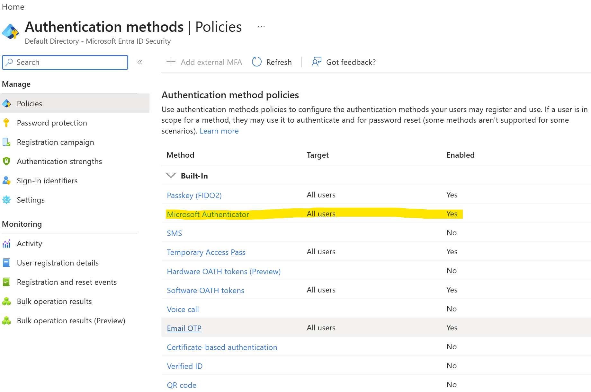
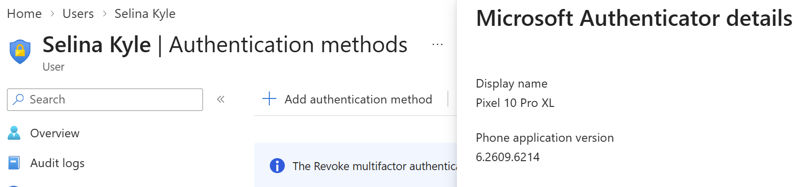
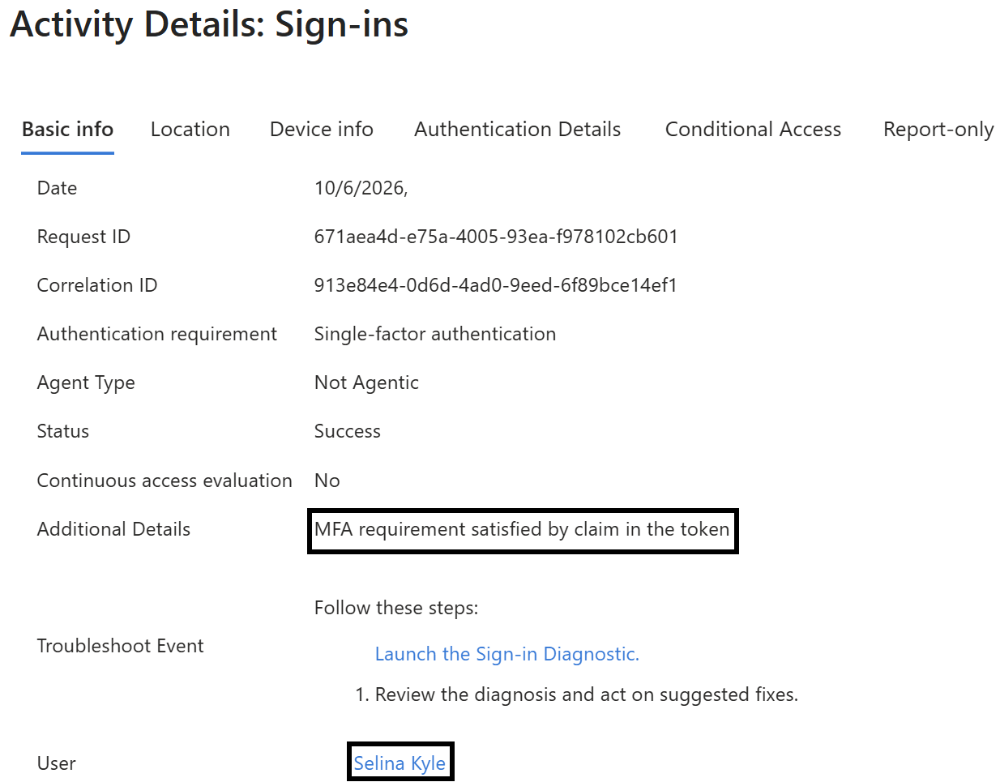
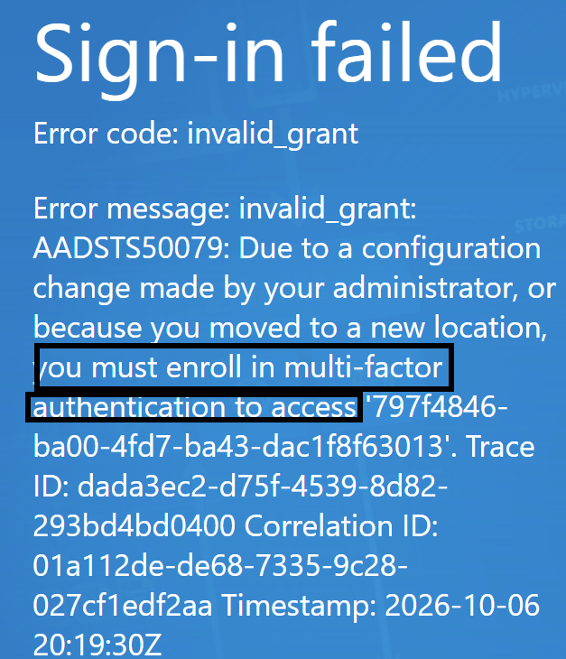
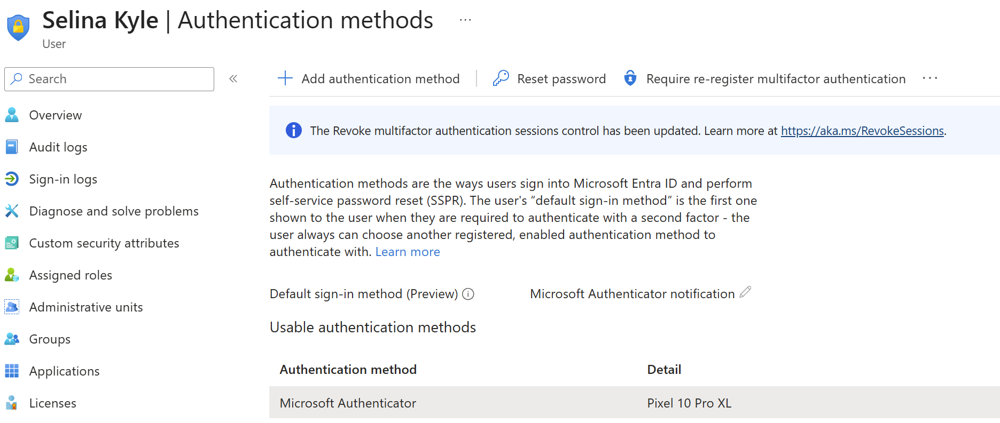
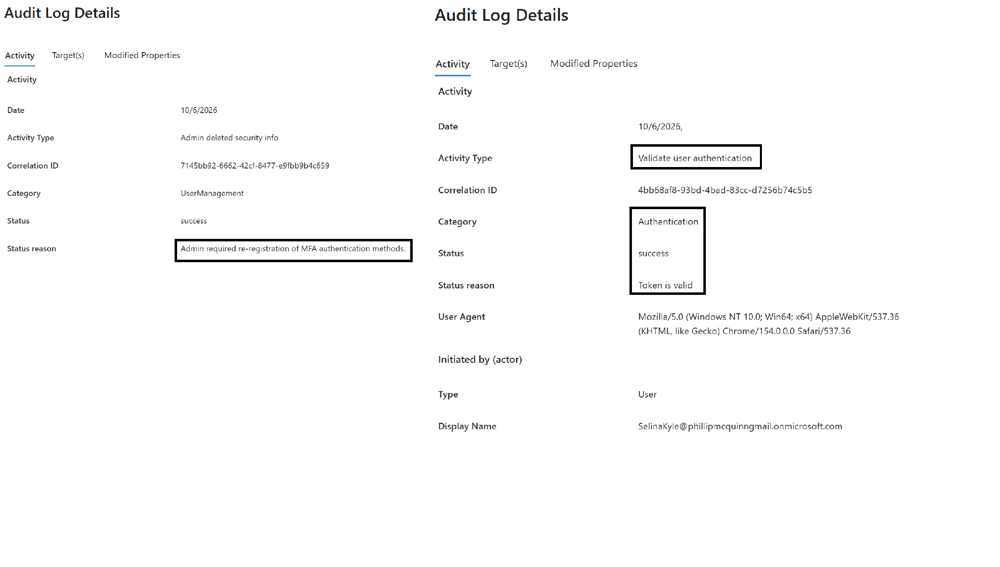

# Lab 04: MFA Registration and Recovery

## Objective

Practice Microsoft Authenticator registration, verify MFA sign-in
behavior, and require a standard test user to re-register MFA.

## Status

Completed

## Environment

| Setting | Value |
|---|---|
| Tenant | Gotham IAM Lab |
| License | Entra ID Free |
| Date performed | October 6, 2026 |
| Test user | Selina Kyle |
| Test user admin roles | None |
| Authentication method | Microsoft Authenticator |
| MFA enforcement mechanism | Security default |
| Administrator role used | Global Admininstrator |

## Scenario

Selina Kyle needs to register Microsoft Authenticator.
Later, she replaces her phone and needs help registering again.

This lab simulates the recovery process using a fictional account.

## Prerequisites

- Selina's account is enabled and available for testing.
- Microsoft Authenticator is installed on the test phone.
- A separate browser session is available for Salina.
- An authorized administrator can manage her authentication methods.
- The main administrator account remains accessible during testing.

## Part 1: Review the Current Configuration

1. Check whether security defaults are enabled.
2. Record the current MFA enforcement mechanism.
3. Review Salina's existing authentication methods.
4. Record whether she is already registered.

Security defaults apply tenant-wide.
If already enabled, document the setting without changing it.

Evidence:

## Part 2: Register Microsoft Authenticator

1. Sign in as Selina in a separate browser session.
2. Follow the registration prompt, or open:
   https://mysignins.microsoft.com/security-info
3. Add Microsoft Authenticator using the displayed instructions.
4. Complete the verification prompt.
5. Confirm the method appears in Selina's Security info.

Do not capture or publish the registration QR code or setup secret.

Evidence:

## Part 3: Review Sign-In Logs

Using an administrator with permission to read sign-in logs:

1. Locate Selina's sign-in event.
2. Review Authentication Details.
3. Record the authentication requirement, methods, and results.
4. Compare the log with the prompts observed during testing.

If MFA was satisfied by an existing claim, document that explicitly.
Do not describe it as a new Authenticator challenge.

Evidence:

## Part 4: Simulate Phone Replacement

Using an authorized administrator:

1. Open Selinas's Authentication methods.
2. Record the existing methods without exposing secrets.
3. Select Require re-register multifactor authentication.
4. Record the confirmation and changes to her method list.
5. Have Selina sign in and complete registration again.
6. Verify the newly registered method.

Perform this action only on the lab user.

Evidence:

## Part 5: Retest and Review Audit Evidence

1. Repeat the sign-in test.
2. Record whether an MFA challenge occurred.
3. Review the relevant sign-in authentication details.
4. Locate available audit events for authentication-method changes.

Evidence:

## Validation Results

| Test | Expected result | Actual result |
|---|---|---|
| Configuration review | Enforcement mechanism identified | MFA configuration was set up with tenant creation and no changes were needed. |
| Authenticator registration | Method appears on test account | User shows authentication set up under authentication method details. |
| Log review | Authentication details explain the sign-in | Audit logs indicated a successful log-in with authentication details |
| Re-registration action | User's applicable methods reset for registration | After requiring user to re-register MFA, user received MFA error log upon sign in attempt. |
| Recovery | User registers Authenticator again | User set up of MFA authentication was successful on desired mobile device.  |
| Retest | Sign-in behavior verified after recovery | User was able to sign in and was required to authenticate with MFA as expected. |

## Troubleshooting

For each issue, record:
- Symptom or error.
- Current authentication configuration.
- Investigation.
- Resolution.
- Retest result.
There was no errors during the lab, all actions taken were completed as expected.

## Cleanup

- Keep the test account in a documented, usable state.
- Remove temporary administrator role assignments, if used.
- Confirm the main administrator remains accessible.
- Confirm screenshots contain no QR codes, secrets, or recovery codes.

## Lessons Learned

Complete after testing:

- The difference between MFA registration and enforcement.
  you can set up MFA registration for everyone, but does not mean its required or enforced to sign in every attempt, in fact there is an exclude list available to prevent MFA Authentication requirements for groups.
- How security defaults affected the test user's sign-ins.
  the user had to reset their password and set up Microsoft Authenticator in order to be granted access to the tenant.
- How Authentication Details supported verification.
  Authentication details include method, type of device used, and version of installed application. These details validate the verification of installed and set up validation moethod.
- How requiring re-registration helped simulate phone replacement.
  re-registration was a simple example of registering a new device or a failed set up.
- Why resetting a password is different from resetting MFA methods.
  MFA methods are a secondary step of authentication beyond a guessable password. There are multiple different methods of MFA, this only shows a token example.
