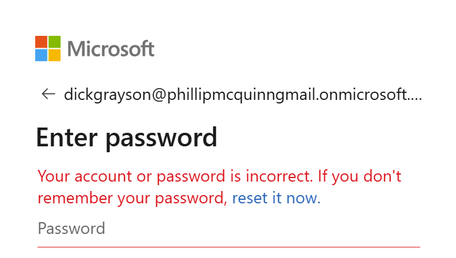
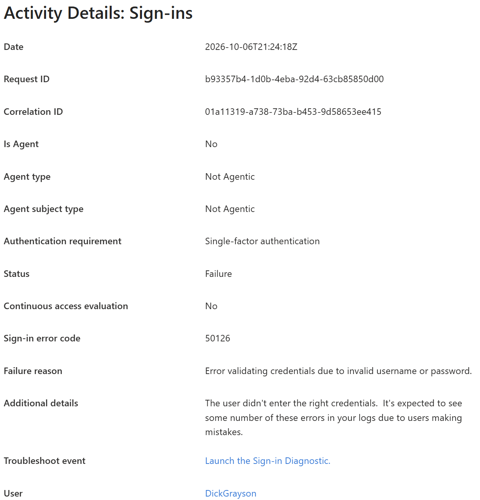
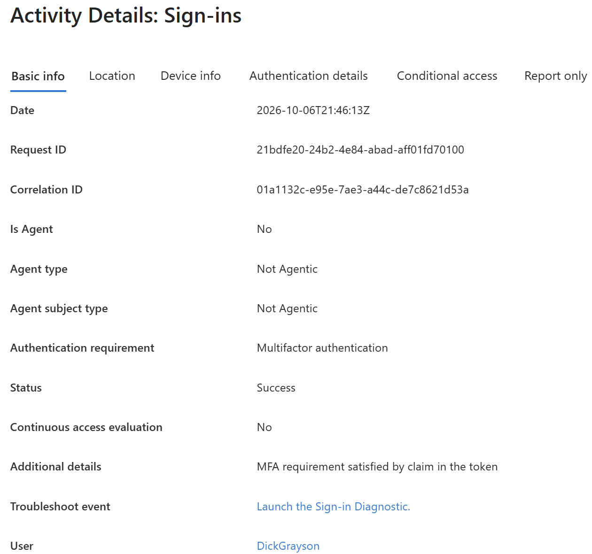
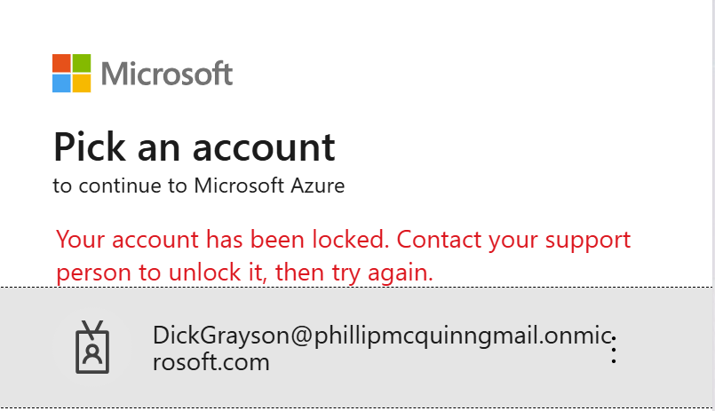
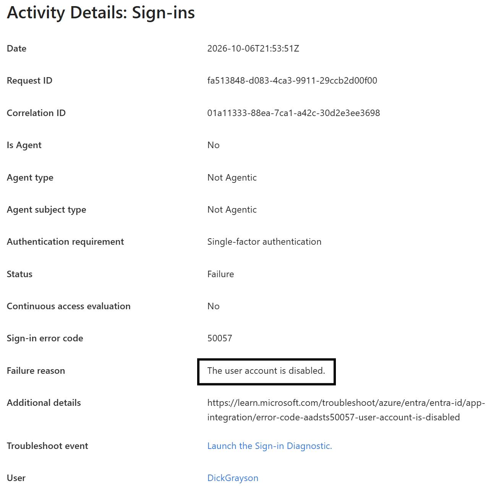
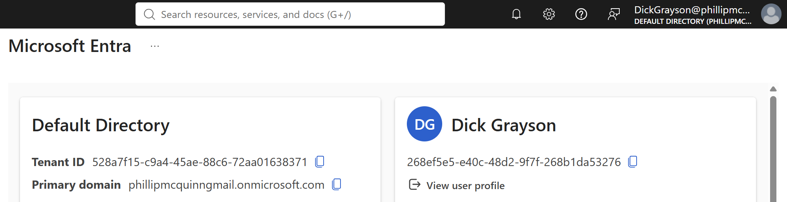

# Lab 05: Sign-In Troubleshooting

## Objective

Investigate failed Microsoft Entra ID sign-ins using error messages,
account settings, and sign-in logs. Apply a targeted fix and verify recovery.

## Status

Completed

## Environment

- Tenant: Gotham IAM Lab
- License: Entra ID-Free
- Date performed: October 6, 2026
- Test user: Dick Grayson
- Administrator role used: Global Administrator
- Time zone used for recorded events: UTC

## Prerequisites

- Test account exists and initially has sign-in enabled.
- A successful baseline sign-in has been verified.
- Administrator can view sign-in logs and perform the required fixes.
- Separate browser sessions are used for administrator and employee.
- Original account configuration has been recorded.

## Investigation Method

For each failed sign-in:

1. Record the username, application, timestamp, and displayed error.
2. Locate the matching event in Sign-in logs.
3. Confirm the user, application, and event time match the test.
4. Review the status, error code, and failure reason.
5. Review Authentication Details and Conditional Access information,
   if available and relevant.
6. Compare the log evidence with the user's account settings.
7. Apply a fix supported by the findings.
8. Repeat the sign-in and document the outcome.

Do not assume every failed sign-in is caused by MFA.

## Case 1: Incorrect Password

### Scenario

Dick Grayson enters an incorrect password.

### Reproduce the Issue

1. Open a separate browser session.
2. Attempt one sign-in with an intentionally incorrect password.
3. Record the displayed error and timestamp.
 "Your account or password is incorrect." 
Avoid repeated attempts that could trigger account lockout.

### Investigation

Locate the matching failed sign-in event.

Record: b93357b4-1d0b-4e4a-92d4-63cb85850d00
- User: DickGrayson
- Timestamp and time zone: 2026-10-06T21:24:18z
- Error code: 50126
- Failure reason: error validating credentials due to invalid username or password.

Evidence:

### Diagnosis

The user explained they are getting a login error with incorrect account password, the logs indicate failed login attempt with incorrect username or password.
  
### Resolution

Retry with the known correct password.
sign-in Successful

If simulating a forgotten password instead, document the authorized
password reset and any password-change prompt.

### Verification

Record whether the user signed in successfully.
Locate the corresponding successful sign-in event.

Evidence:

## Case 2: Sign-In Blocked

### Scenario

Dick's account was disabled during offboarding, but he now needs
to return to the lab.

### Reproduce the Issue

Using the administrator account:

1. Block sign-in for Dick's test account.
2. Confirm the disabled state.
3. Attempt a fresh sign-in as Dick in a separate browser session.
4. Record the displayed error and timestamp.

### Investigation

1. Locate the matching failed sign-in event.
fa513848-do83-4ca3-9911-29ccb2d00f00
2. Record the error code and failure reason.
The User account is disabled.
3. error code.
50057
4. Review Dick's account status.
User account is disabled.
5. Confirm whether the account state explains the failure.
yes, the account state is disabled, preventing the user from logging into the tenant.

Evidence:

### Diagnosis

Looking at the sign-in logs and viewing a failure status for a log entry, the failure status provides a good explaination of what the reason is.
  
### Resolution

The lab scenario explicitly authorizes re-enabling the fictional account.

1. Unblock sign-in.
2. Confirm the account is enabled.
3. Record the time of the change.

In a real environment, verify authorization before restoring access
to an offboarded employee.

### Verification

1. Attempt a fresh sign-in.
2. Record the outcome.
3. Locate the successful sign-in event.
4. Record any delay between re-enabling the account and successful access.

Evidence:

## Results

| Case | Observed cause | Fix applied | Retest result |
|---|---|---|---|
| Incorrect password | incorrect password | asked user to sign in with last known password | Resolved, user sign-in was successful.  |
| Sign-in blocked | account was disabled | enabled account | Resolved, user sign-in was successful. |

## Troubleshooting Notes

Document any investigation difficulties, such as:
- Log events taking time to appear.
there is a couple minute delay in the event logs showing in the tenant.
- Selecting the wrong application or time range.
by validating a failed event and matching time stamps, the selection of wrong events is slim.
- Existing browser sessions affecting the test.
no browser sessions were impacted during the lab.
- Missing permissions to view logs.
no permission issues during lab.
- A different failure occurring before the expected one.
no other failures occurred during the lab.

Record how each difficulty was resolved.

## Cleanup

- Confirm Dick's sign-in is enabled.
- Restore any settings changed during testing.
- Remove temporary administrator role assignments.
- Sign out of test sessions.
- Check screenshots for passwords and personal information.

## Lessons Learned

Complete after testing:

- How timestamps help match a user's report to a sign-in event.
  Log-in logs can get crowded with multiple users. time stamps can help quickly narrow the search to the log required for troubleshooting.
- Why error codes should be interpreted with the failure reason.
  error codes and failure reason can vary if the reason given can me mulltiple failure points.
- How account settings and logs support diagnosis together.
- error logs can give a good starting point for troubleshooting root cause of an issue as long as thr failure reason in percise.
- Why a successful retest is needed to confirm resolution.
  error logs may only indicate one failure point, if a retest in unsuccessful, there may be more troubleshooting required to find multiple failure points, or root cause. Validating issues resolved and record keeping are a key component of any good troubleshooting.
