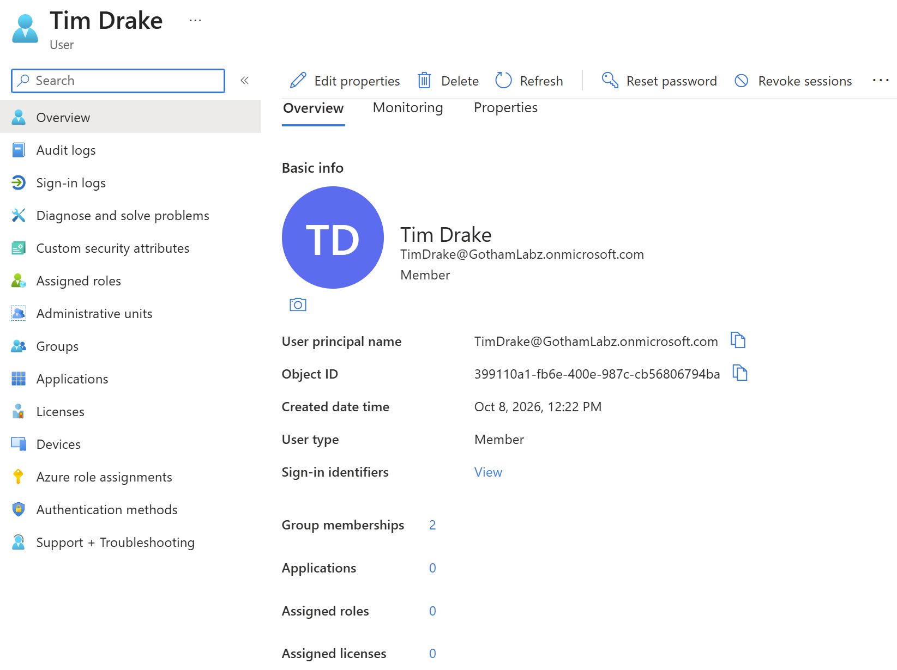
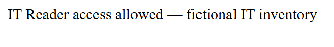
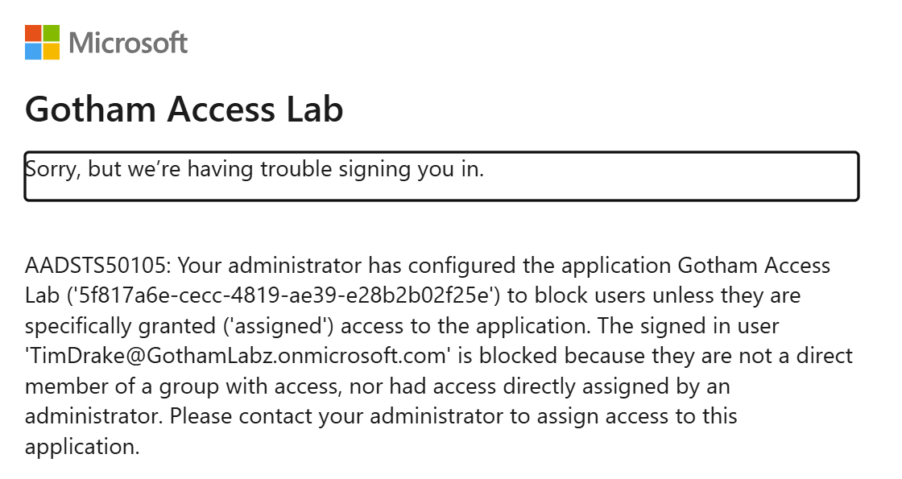

# Lab 06: Joiner–Mover–Leaver Identity Lifecycle Management

## Objective

Practice managing an employee account through onboarding (Joiner), department transfer (Mover), periodic access review, and offboarding (Leaver). Verify group-based application access and document observed sign-in results without confusing application assignment failures with disabled-account enforcement.

## Status

Completed for the actions documented in screenshots; additional verification items are identified below. Evidence captured October 8, 2026.

## Employee Scenario

Tim Drake is the fictional employee in Gotham IAM Lab. He begins with access to an IT Reader role, then moves to Procurement. An access review subsequently removes his Procurement assignment. Finally, his account is disabled and a later sign-in attempt is denied.

| Attribute | Joiner | Mover |
|---|---|---|
| Display name | Tim Drake | Tim Drake |
| Username | TimDrake@GothamLabz.onmicrosoft.com | TimDrake@GothamLabz.onmicrosoft.com |
| Job title | Communication Specialist | Communication Specialist |
| Department | IT | Procurement |
| Company | Gotham IT Labs | Gotham IT Labs |
| Employee ID | WE006 | WE006 |
| Employee type | FTE | FTE |
| Manager | Lucius Fox | Selina Kyle |
| App-reader group | `SG-GothamApp-IT-Readers` | `SG-GothamApp-Procurement-Readers` |

## Prerequisites

- Access to the personal Gotham IAM Lab tenant.
- Administrator permissions to manage users, groups, application assignments, and access reviews.
- Tim Drake account and the IT and Procurement reader groups.
- Fictional IT inventory and Procurement application resources used for the access tests.
- Microsoft Entra ID P2 license (assigned in the Joiner evidence).
- Separate employee browser session for access tests.
- Access to Entra ID audit and sign-in logs.

Record the actual administrator role and licensing used:

- **Administrator role:** Global Administrator
- **License edition:** Microsoft Entra ID P2

## Part 1: Baseline and Joiner — Onboarding

### 1. Record baseline application access

Before provisioning, attempt access to the fictional IT and Procurement resources. Both pages returned **Unauthorized**. These screenshots document the starting behavior, not the underlying cause of denial.

Evidence:

### 2. Verify the employee account

Open Tim Drake in Entra ID. The screenshot shows the user principal name and account creation date. It does not independently show an account creation operation.

Evidence:

### 3. Assign and verify licensing

Verify Tim's Microsoft Entra ID P2 license assignment.

Evidence:

### 4. Assign IT Reader group membership

Verify Tim's direct membership in `SG-GothamApp-IT-Readers`.

Evidence:

### 5. Verify application role and access

Inspect the claims/identity page for the IT Reader role. Test the fictional IT inventory and Procurement endpoints from the employee session.

**Observed:** The IT inventory returned **IT Reader access allowed**; Procurement returned **Forbidden**.

Evidence:

## Part 2: Mover — Department Transfer

### 1. Update employee department attributes

Verify Tim's job information now shows:

- **Department:** Procurement
- **Company:** Gotham IT Labs
- **Employee ID:** WE006
- **Employee type:** FTE
- **Job title:** Communication Specialist

Evidence:

### 2. Change reader-group membership

Verify Tim's membership in `SG-GothamApp-Procurement-Readers`.

Evidence:

### 3. Verify new access and old access removal

In a separate application session, test Procurement and IT resources. **Procurement Reader access was allowed**; IT returned **Forbidden**.

Evidence:

## Part 3: Access Review — Remove Temporary Procurement Access

### 1. Configure the access review

Inspect the review configuration for temporary Procurement application access.

Evidence:

### 2. Record the reviewer decision

The lab reviewer denied Tim Drake's continued temporary Procurement access with the reason: *Simulated temporary Procurement assignment ended; remove application access.*

Evidence:

### 3. Inspect review results and removal

Examine the review/audit activity, verify that no direct members remain in the Procurement Readers group, and test the application again.

The follow-up sign-in displays **AADSTS50105**: access requires assignment, and the user lacks a direct or group assignment. This demonstrates application-assignment denial, not disabled-account enforcement.

Evidence:

## Part 4: Leaver — Offboarding

### 1. Block employee sign-in

Disable Tim Drake's account and verify its **Disabled** status in Entra ID.

Evidence:

### 2. Revoke active sessions

Open the **Revoke sessions** control. The screenshot captures the confirmation dialog; it does not independently prove revocation completed.

Evidence:

### 3. Test a fresh sign-in

The employee sign-in page displays: **“Your account has been locked. Contact your support person to unlock it, then try again.”**

Evidence:

The separately observed **AADSTS50105** application-assignment failure should not be treated as evidence that a disabled account caused that particular sign-in failure.

## Cleanup

Tim Drake's account was restored to the Procurement department and re-enabled for a future lab.

## Issues and Troubleshooting

**Symptom:** Extensive delays before login and audit events appeared in the tenant.

**Investigation:** Refreshed the browser cache and started a new session.

**Result:** Neither action produced a noticeable improvement. The delay remained unresolved during this exercise.

## Lessons Learned

- JML controls require both identity attribute changes and access assignment changes.
- Security group membership can determine application access, but should be verified through actual resource tests.
- An access-review **Deny** decision can be validated using both membership evidence and downstream application denial.
- An application assignment error such as **AADSTS50105** is different from disabled-account enforcement.
- Audit and sign-in log visibility may be delayed; record the observed timing rather than assuming immediate propagation.
