Lab 06: Joiner–Mover–Leaver Identity Lifecycle Management

Objective

Practice managing an employee account through onboarding (Joiner), department transfer (Mover), periodic access review, and offboarding (Leaver). Verify group-based application access and document observed sign-in results without confusing application assignment failures with disabled-account enforcement.

Status

Completed for the actions documented in screenshots; additional verification items are identified below. Evidence captured October 8, 2026.

Employee Scenario
Tim Drake is the fictional employee in Gotham IAM Lab. He begins with access to an IT Reader role, then moves to Procurement. An access review subsequently removes his Procurement assignment. Finally, his account is disabled and a later sign-in attempt is denied.

Attribute	| Joiner	| Mover |
Display name	|Tim Drake | Time Drake |
Username	| TimDrake@GothamLabz.onmicrosoft.com | TimDrake@GothamLabz.onmicrosoft.com |
Job | Communication Specialist | Communication Specialist |
Department	| IT | Procurement |
Company	| Gotham IT Labs |Gotham IT Labs |
Employee | WE006 |	WE006 |
Employee type	| FTE | FTE |
Manager	| Lucious Fox | Selina Kyle |
App-reader group	| SG-GothamApp-IT-Readers	| SG-GothamApp-Procurement-Readers |

Prerequisites
Access to the personal Gotham IAM Lab tenant.
Administrator permissions to manage users, groups, application assignments, and access reviews.
Tim Drake account and the IT and Procurement reader groups.
Fictional IT inventory and Procurement application resources used for the access tests.
Microsoft Entra ID P2 license (assigned in the joiner evidence).
Separate employee browser session for access tests.
Access to Entra ID audit and sign-in logs.
Record the actual administrator role and licensing used:
Administrator role: Global ADministrator
License edition: Microsoft Entra ID P2

Part 1: Baseline and Joiner — Onboarding

1. Record baseline application access
Before provisioning, attempt access to the fictional IT and Procurement resources. Both pages returned Unauthorized. These screenshots document the starting behavior, not the underlying cause of denial.

Evidence:
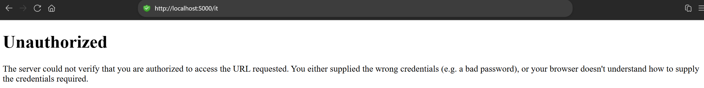, 
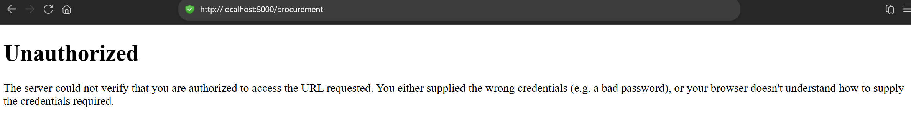

2. Verify the employee account
Open Tim Drake in Entra ID. The screenshot shows the user principal name and account creation date. It does not independently show an account creation operation.

Evidence: `!9Time Drake Account](screenshots/03-joiner-account-overview.png)

3. Assign and verify licensing
Verify Tim's Microsoft Entra ID P2 license assignment.

Evidence:
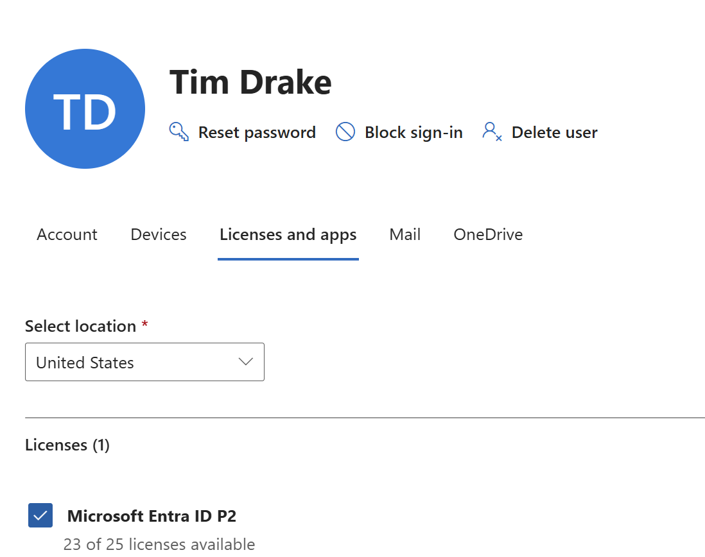

4. Assign IT Reader group membership
Verify Tim's direct membership in `SG-GothamApp-IT-Readers`.

Evidence:
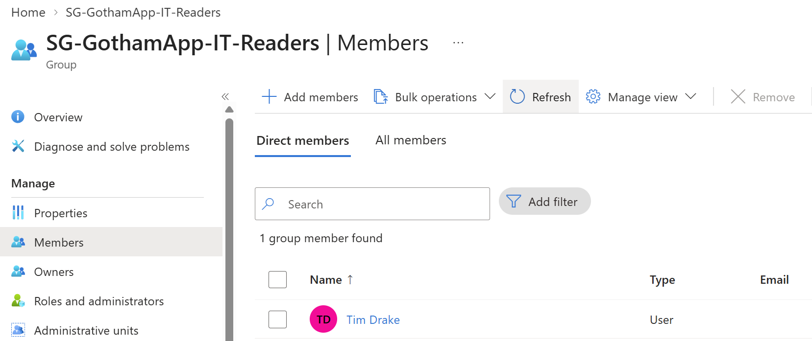

5. Verify application role and access
Inspect the claims/identity page for the IT Reader role. Test the fictional IT inventory and Procurement endpoints from the employee session.

Observed: the IT inventory returned IT Reader access allowed; Procurement returned Forbidden.

Evidence:
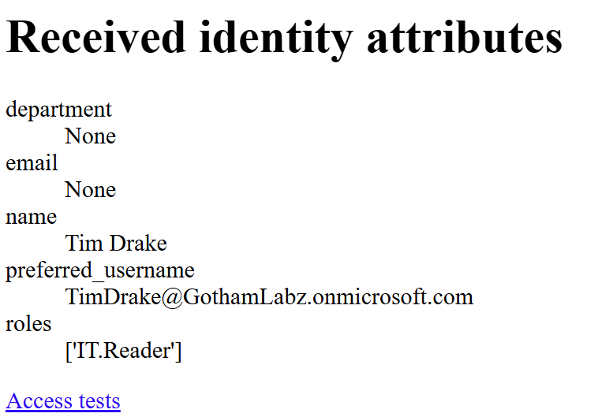
!joiner IT Access Allowed](screenshots/07-joiner-it-access-allowed.png)

Part 2: Mover — Department Transfer

1. Update employee department attributes
Verify Tim's job information now shows Department = Procurement, Company = Gotham IT Labs, Employee ID = WE006, Employee type = FTE. Job title = Communication Specialist.

Evidence:
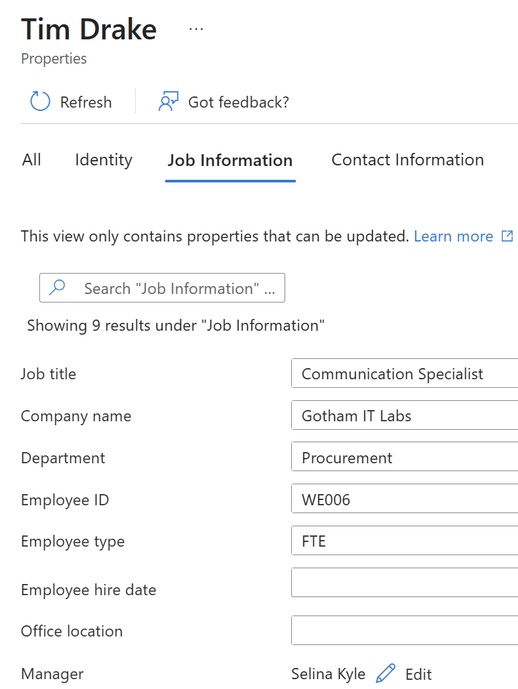

2. Change reader-group membership
Verify Tim in `SG-GothamApp-Procurement-Readers`.

Evidence:
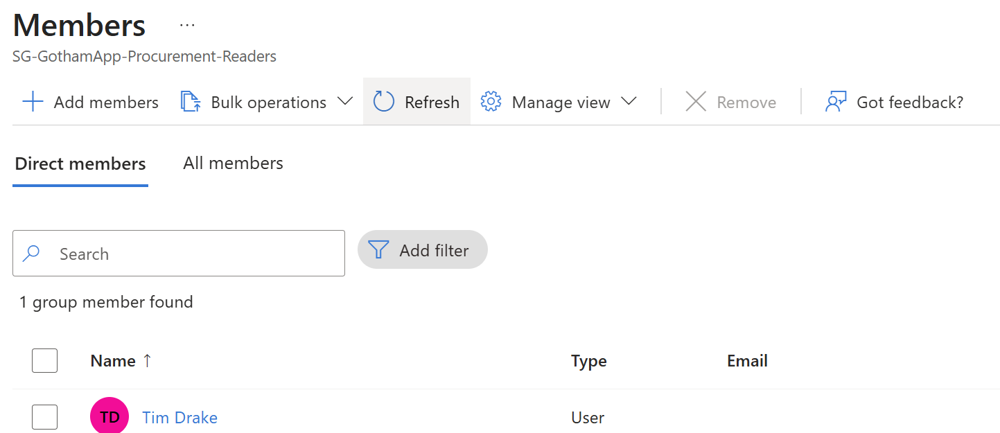

3. Verify new access and old access removal
In a separate application session, test Procurement and IT resources. Procurement Reader access was allowed; IT returned Forbidden.
Evidence:

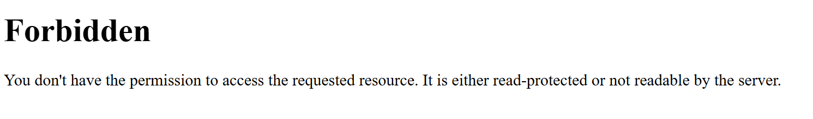

Part 3: Access Review — Remove Temporary Procurement Access

1. Configure the access review
Inspect the review configuration for temporary Procurement application access. 

Evidence:
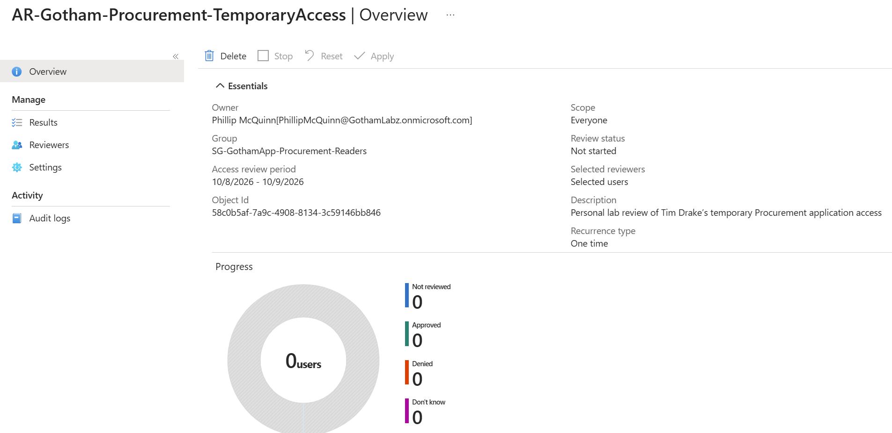

2. Record the reviewer decision
Lab decision denied Tim Drake's continued temporary Procurement access, with the reason: simulated temporary Procurement assignment ended; remove application access.

Evidence:
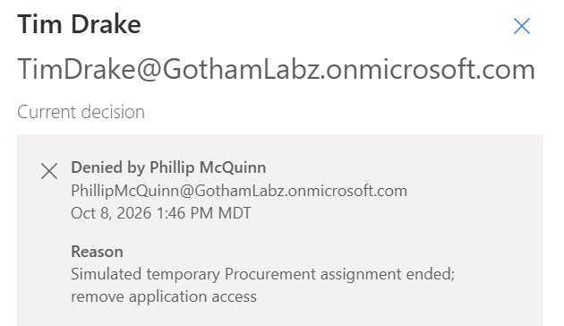

3. Inspect review results and removal
Examine the review/audit activity, verify no direct members remain in the Procurement Readers group, and test the application again. The follow-up sign-in displays AADSTS50105: access requires assignment and the user lacks direct/group assignment.

Evidence:
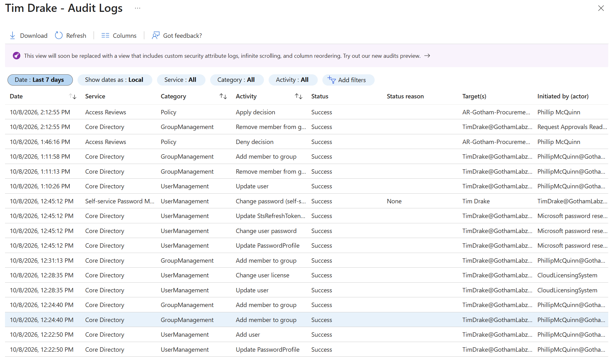
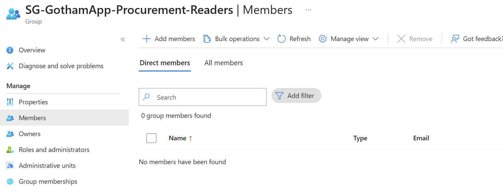
!access review application access denied](screenshots/18-access-review-application-access-denied.png)

Part 4: Leaver — Offboarding

1. Block employee sign-in
Disable Tim Drake's account and verify its Disabled status in Entra ID.

Evidence:
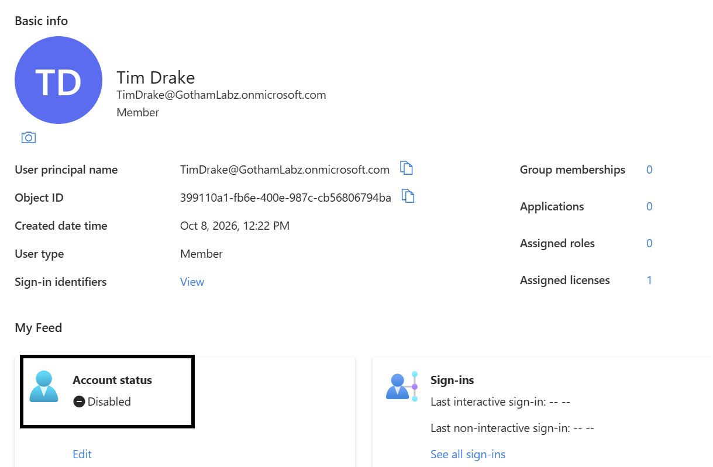

2. Revoke active sessions
Open the Revoke sessions control. The screenshot captures the confirmation dialog.

Evidence:
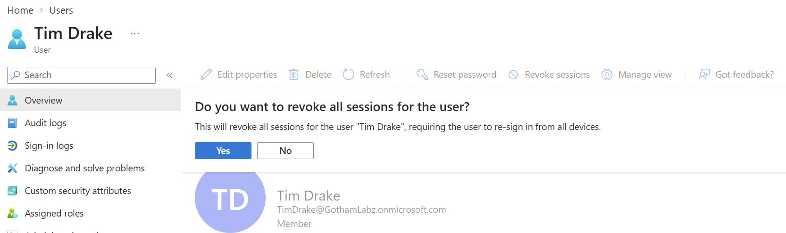

3. Test a fresh sign-in
The employee sign-in page displays Your account has been locked. Contact your support person to unlock it, then try again.

Evidence:
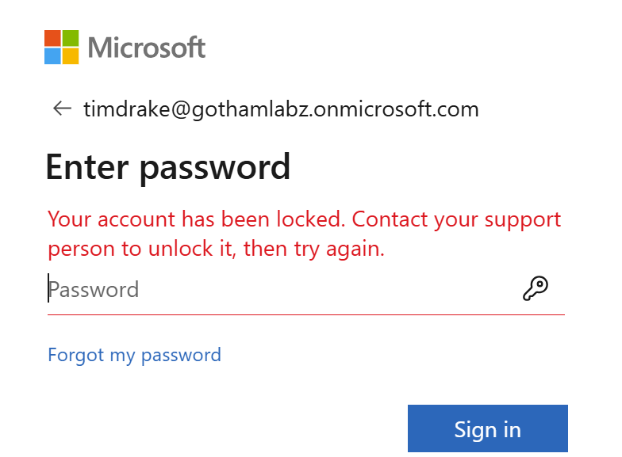

Cleanup
Tim Drake's account was restored to the procurement department and re-enabled for a future lab.

Issues and Troubleshooting
noted extensive delay in login/audit logs showing in tenant. Refreshed browser cache and logged into a new session, no improvement noticed.

Lessons Learned
JML controls require both identity attribute changes and access assignment changes.
Security group membership can determine application access, but should be verified through actual resource tests.
An access-review Deny decision can be validated using both membership evidence and downstream application denial.
