# Lab 07: Conditional Access and Identity Protection

## Objective

Practice configuring Microsoft Entra Conditional Access policies for user MFA, administrator phishing-resistant MFA, legacy authentication blocking, and risk-based access. Verify group and role targeting using What If simulations, transition from Security Defaults to enforced policies, and validate results in actual sign-in logs.

Distinguish policy configuration, simulated evaluation, and real enforcement. Do not label an unobserved blocked legacy sign-in or risky sign-in as a successful enforcement test.

## Status

Completed

## Lab Scenario

Gotham IAM Lab uses seven fictional regular users and two administrator accounts. Regular users require MFA. A regular Global Administrator must meet a phishing-resistant authentication strength requirement, while a separate Lab Recovery Administrator remains available for emergency access. A legacy-client policy blocks selected older authentication clients. A risk-based policy is evaluated in Report-only mode for Medium and High sign-in risk.

| Attribute | Lab configuration |
|---|---|
| Tenant | GothamLabz.onmicrosoft.com |
| Regular user test identity | Tim Drake |
| Regular administrator test identity | Phillip McQuinn |
| Emergency account | Lab Recovery Administrator |
| Regular-user group | `SG-CA-Lab-Users` (7 members) |
| Regular administrator passkey group | `SG-Auth-WindowsHello-Admins` |
| Recovery passkey group | `SG-Auth-WindowsHello-Recovery` |
| License edition | Microsoft Entra ID P2 |
| License inventory | 9 assigned |
| MFA registration report | 9 accounts listed as MFA capable |

## Prerequisites

- Access to the personal Gotham IAM Lab tenant.
- Global Administrator privileges for the administrator actions performed.
- Microsoft Entra ID P2 licenses for the targeted test accounts.
- `SG-CA-Lab-Users` with seven regular users.
- Microsoft Authenticator registered for the lab accounts.
- Windows Hello passkeys registered and independently tested for the regular and recovery administrators.
- A working recovery administrator session before enforcing Conditional Access.
- Access to Conditional Access, What If, sign-in logs, and Identity Protection.

Administrative environment used:

- **Administrator role:** Global Administrator
- **License edition:** Microsoft Entra ID P2

## Part 1: Identity, Licensing, and Authentication Preparation

### 1. Verify regular-user group membership

Confirm seven direct members of `SG-CA-Lab-Users`. Membership establishes policy targeting; it does not by itself prove successful MFA or application access.

Evidence:

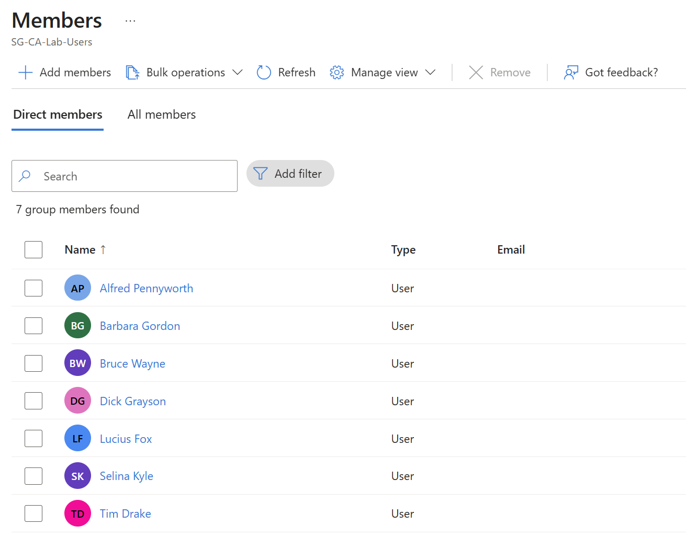

### 2. Verify license coverage

Review the Microsoft Entra ID P2 license inventory: **25 total licenses, 9 assigned**.

Evidence:

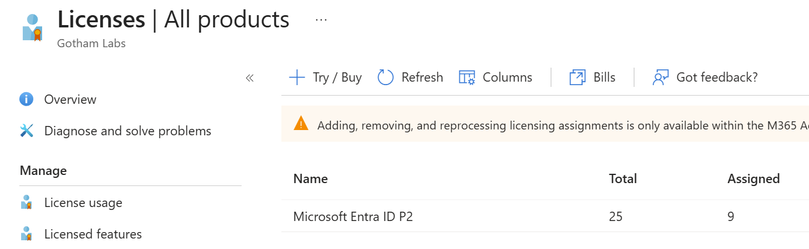

### 3. Review MFA registration

Inspect the user registration report. The nine lab accounts appear as **MFA capable**. This is registration evidence, not evidence that Conditional Access has enforced MFA.

Evidence:

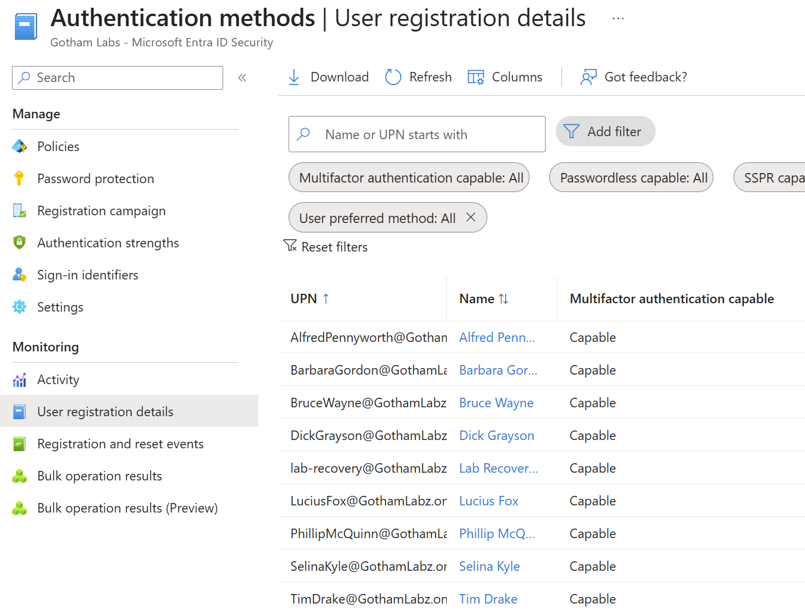

### 4. Verify Windows Hello passkeys

Verify the Lab Recovery Administrator and regular administrator each have a registered **device-bound Windows Hello passkey**. Windows Hello sign-ins were also successfully tested during the exercise, although the selected screenshots show registration rather than method-specific sign-in log proof.

Evidence:

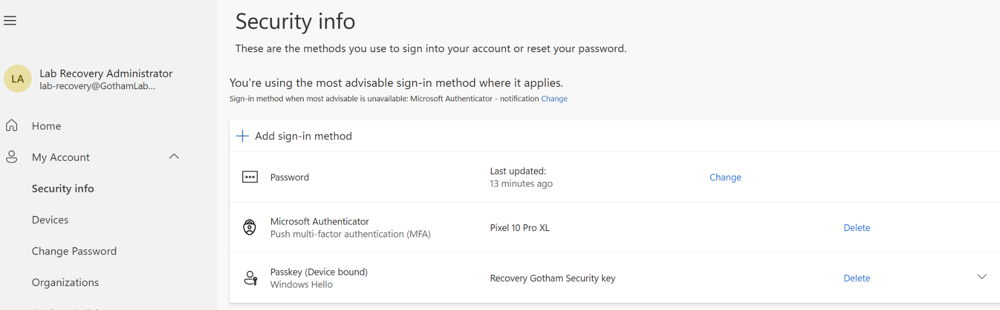

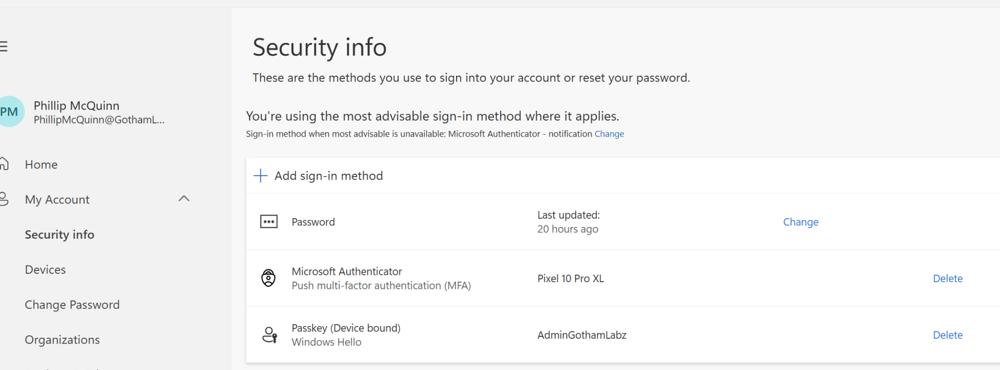

## Part 2: Conditional Access Policy Configuration

### 1. Configure the initial policy set in Report-only mode

Create and evaluate the six policies. Record their intended identity scope, grants, conditions, exclusions, and policy states.

| Policy | Purpose | Final state |
|---|---|---|
| `CA-00-Lab-Admin-MFA` | Require MFA for the regular administrator | On |
| `CA-01-Lab-Users-MFA` | Require MFA for `SG-CA-Lab-Users` | On |
| `CA-02-Admins-PhishingResistant` | Require phishing-resistant MFA for selected directory roles; exclude recovery administrator | On |
| `CA-03-Lab-Block-Legacy` | Block Exchange ActiveSync and Other legacy clients for scoped users | On |
| `CA-04-Lab-Recovery-MFA` | Evaluate phishing-resistant authentication for recovery account | Report-only |
| `CA-05-Lab-SignInRisk-MFA` | Evaluate Medium- and High-risk sign-ins for the user group | Report-only |

The original six-policy list was captured while all policies were in **Report-only** mode.

Evidence:

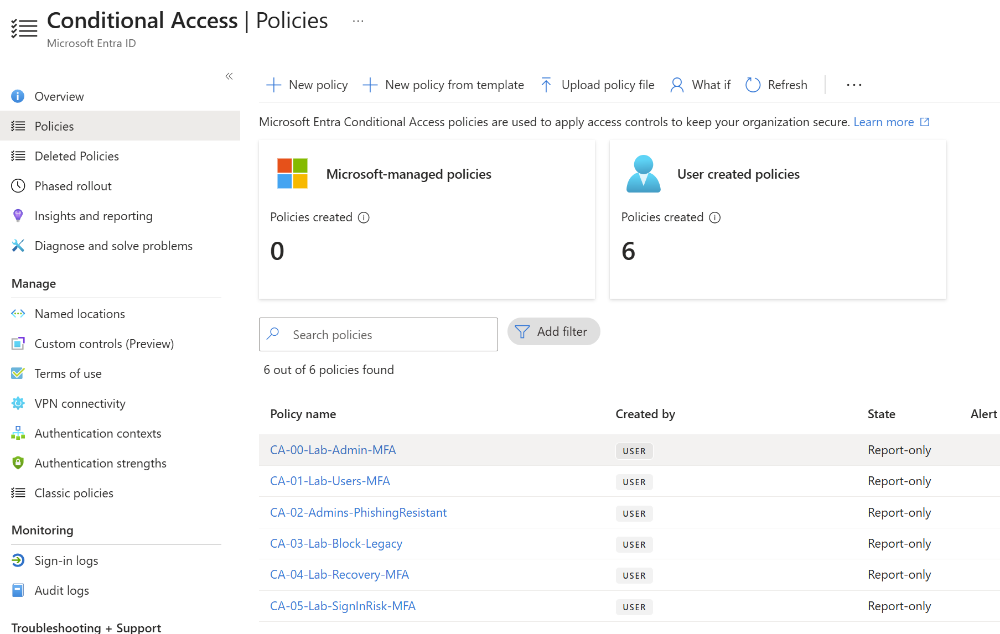

### 2. Verify user MFA policy targeting

Use **What If** to simulate a sign-in for Tim Drake. Confirm `CA-01-Lab-Users-MFA` applies. What If confirms targeting, not an enforced MFA challenge.

Evidence:

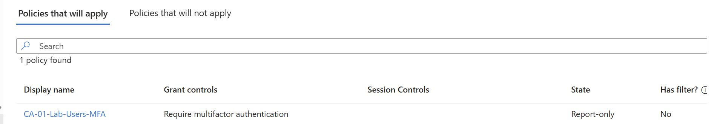

### 3. Verify legacy authentication blocking conditions

Simulate a legacy client using **Other clients** and verify `CA-03-Lab-Block-Legacy` is evaluated with **Block**. Do not treat this as a real blocked protocol sign-in.

Evidence:

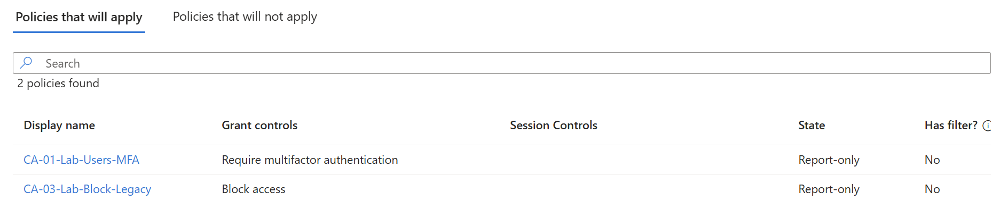

### 4. Verify recovery account exclusions

Run What If for the Lab Recovery Administrator. Confirm `CA-02-Admins-PhishingResistant` does not apply due to **Users and groups** targeting/exclusion. `CA-04-Lab-Recovery-MFA` is separate and remains Report-only.

Evidence:

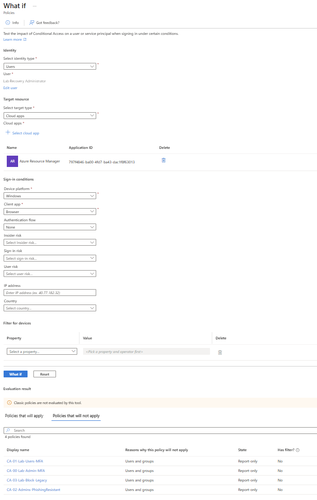

### 5. Verify administrator phishing-resistant targeting

Simulate regular administrator access to Azure Resource Manager. Verify both `CA-00-Lab-Admin-MFA` and `CA-02-Admins-PhishingResistant` apply. The stronger authentication strength must be satisfied when enforcement is enabled.

Evidence:

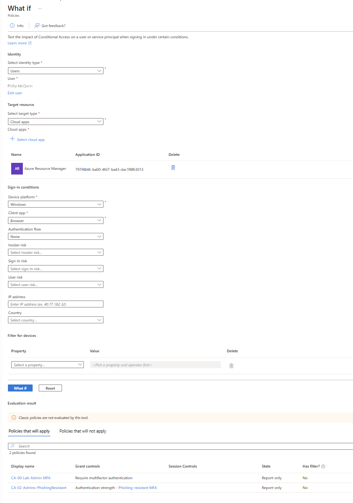

## Part 3: Identity Protection — Sign-In Risk

### 1. Test a simulated Medium-risk sign-in

Select Tim Drake, Azure Resource Manager, Windows, Browser, and **Medium** sign-in risk. Both `CA-01` and `CA-05` match the simulation.

Evidence:

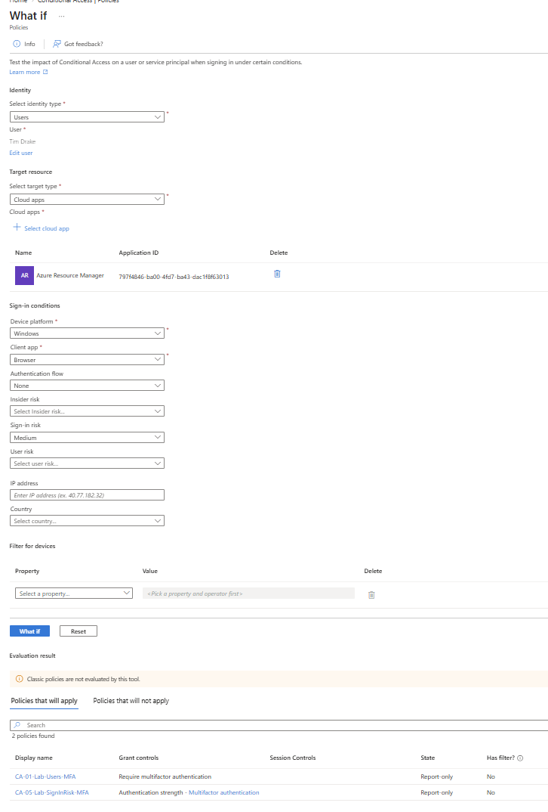

### 2. Test a simulated High-risk sign-in

Repeat the simulation with **High** sign-in risk. Both `CA-01` and `CA-05` match again.

Evidence:

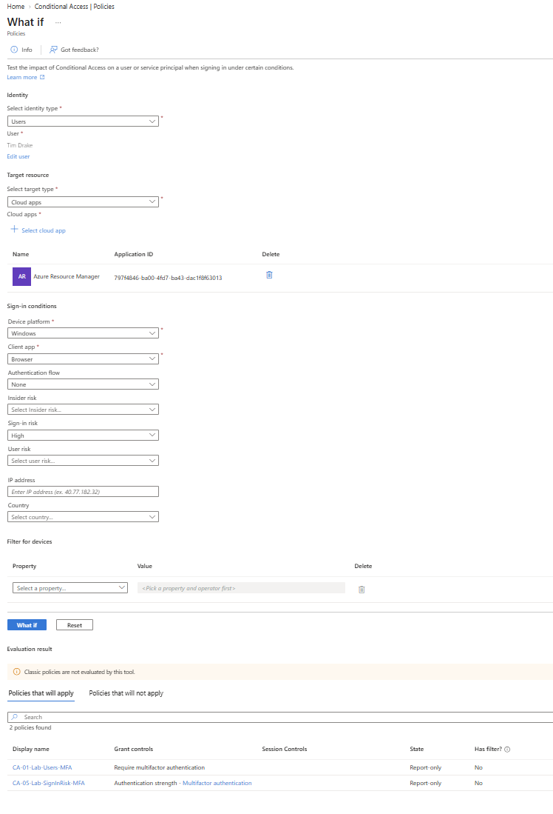

### 3. Record the limit of the simulations

What If does not generate a real Identity Protection risk detection or prove risk-policy enforcement. `CA-05` remains Report-only. No real risky-sign-in enforcement event was documented.

## Part 4: Security Defaults Transition and Policy Enforcement

### 1. Record the transition plan

Security Defaults was **Enabled** before the transition. After testing administrator recovery access and passkeys, the tenant administrator disabled Security Defaults and enabled replacement policies. The Disabled state was confirmed during the exercise but is not shown in the selected minimal screenshot set.

Retain a working recovery administrator session during policy changes. Avoid leaving Security Defaults disabled without appropriate enforced replacement controls.

### 2. Verify enforced policy states

Confirm `CA-00`, `CA-01`, `CA-02`, and `CA-03` show **On**. Confirm `CA-04` and `CA-05` remain **Report-only**.

Evidence:

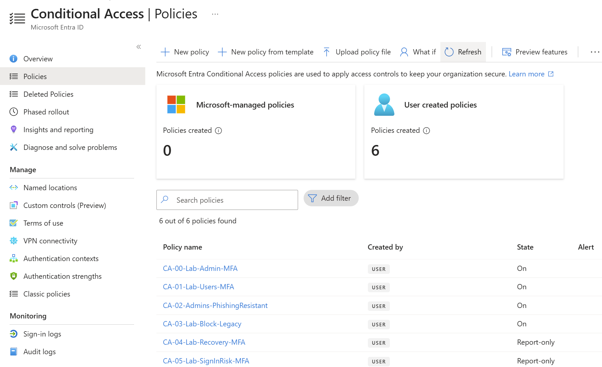

### 3. Test regular-user MFA enforcement

Perform a real sign-in as Tim Drake and inspect the **Conditional access** tab. The event shows `CA-01-Lab-Users-MFA` as **Success**. This is an actual enforced-policy result, not a What If simulation.

Evidence:

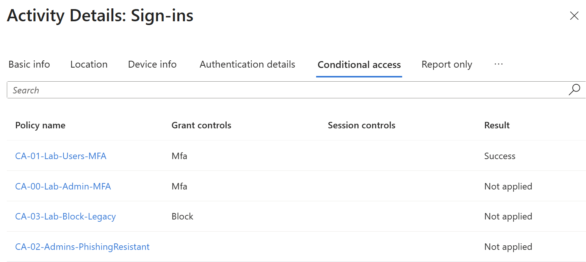

### 4. Test administrator phishing-resistant MFA enforcement

Perform a real administrator sign-in and inspect the sign-in event. `CA-00-Lab-Admin-MFA` and `CA-02-Admins-PhishingResistant` show **Success**.

The Authentication details page identifies a **phishing-resistant** requirement as satisfied, but shows **Previously satisfied**. That event does not, by itself, prove a new Windows Hello gesture occurred during this particular sign-in. Windows Hello capability was separately tested earlier.

Evidence:

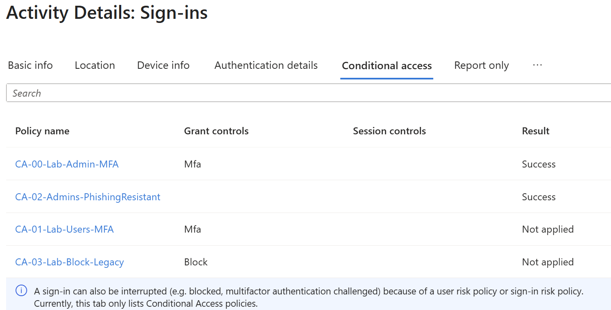

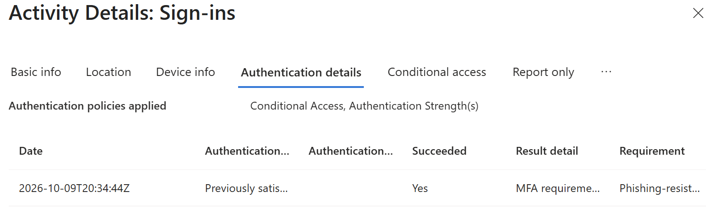

### 5. Confirm emergency administrative access

After enforcement, the Lab Recovery Administrator successfully signed in with Windows Hello and accessed the Conditional Access policies page. This was user-confirmed during the exercise; the minimal screenshots document passkey registration but not a dedicated method-specific sign-in log for this test.

## Part 5: Legacy Authentication Investigation

### 1. Search for legacy client sign-in attempts

Filter the sign-in logs for **Exchange ActiveSync** and **Other clients**. The available interactive sign-in screenshot shows **No results** for the filtered 24-hour period.

Evidence:

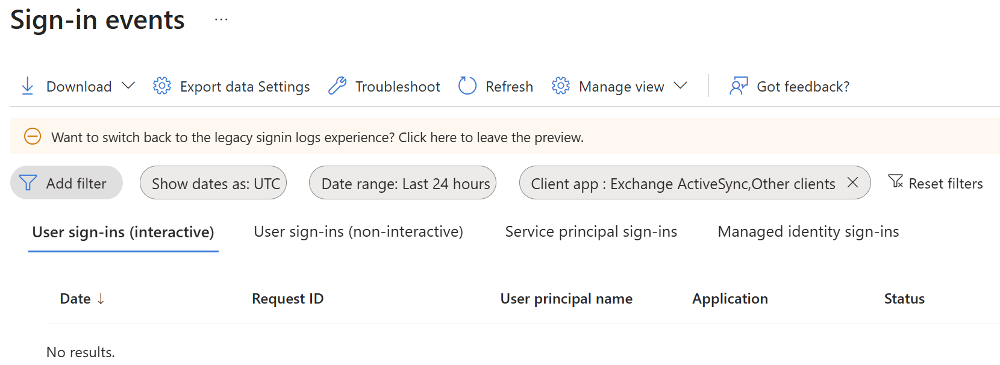

### 2. Document the enforcement-test limitation

The policy is configured and On, and its What If targeting was successful. However, no actual legacy client sign-in was captured with `CA-03` showing a blocked result.

**Actual blocked legacy sign-in: Not tested — no matching event available.**

## Cleanup

- Keep the four baseline protection policies **On** in the lab unless intentionally conducting a controlled change.
- Keep the recovery training policy and risk-policy simulation **Report-only** until their intended enforcement behavior is separately planned and tested.
- Keep the Lab Recovery Administrator available and its authentication methods intact.
- Record any future policy changes, exclusions, rollback actions, and timestamps.
- No deletion or restoration of these six policies was documented as part of this exercise.

## Issues and Troubleshooting

- **Security Defaults prevented custom Conditional Access enforcement.** The transition was deferred until replacement policies and recovery access were prepared.
- **Report-only and disabled sign-in log results initially caused confusion.** Verified targeting through What If and later verified actual enforcement separately.
- **Recovery passkey profile naming/assignment was confusing.** Confirmed the custom profile, group targeting, allowed Windows Hello authenticators, and successful passkey registration.
**Issue: Windows Hello Passkey Registration**

**Symptom:** Windows Hello passkey registration could not be completed using the DuckDuckGo browser.

**Investigation:** The registration process was retried, and browser compatibility was identified as a potential contributing factor.

**Resolution:** Switched to a compatible browser and successfully registered the Windows Hello passkey.

**Verification:** Confirmed successful authentication using the registered Windows Hello passkey to access the Microsoft Entra admin center.

**Lesson Learned:** Browser compatibility can affect passkey registration and authentication workflows. When troubleshooting passkey enrollment issues, verify browser support before investigating account configuration or tenant authentication policies.
- **Sign-in logs sometimes reported previously satisfied MFA.** Recorded that result without claiming a fresh prompt for the specific event.
- **No actual legacy-client event appeared in the filtered logs.** Recorded the protocol block as not tested rather than claiming a demonstrated denial.

## Lessons Learned

- MFA-capable registration is different from MFA enforcement.
- Conditional Access What If confirms targeting but not successful real-world authentication.
- Phishing-resistant administrator access requires a compatible method such as a Windows Hello passkey; Authenticator push alone does not satisfy that authentication strength.
- Administrator recovery planning should precede policy activation.
- An enforced-policy Success result may be satisfied by a previously issued authentication claim.
- Legacy client blocking requires a matching real sign-in event to demonstrate actual denial.
- P2 Identity Protection simulations can validate risk-policy scope without creating risk detections.
