# Lab 08: Enterprise Application Integration and Troubleshooting

## Objective

Practice integrating a locally hosted application with Microsoft Entra ID, configuring application roles and group-based enterprise application assignments, investigating administrator consent and application launch problems, and testing how removing a security group membership affects existing and fresh sessions.

Verify real results separately from configuration settings, observed behaviors, and troubleshooting hypotheses.

## Status

**Completed — hands-on authentication, authorization, visibility troubleshooting, and access-revocation tests.**

Evidence captured October 8, 2026. Some outcomes were observed and reported during testing without separate screenshots, as indicated below.

## Application Scenario

Gotham Access Lab is a local Python Flask application that authenticates against the GothamLabz Microsoft Entra ID tenant. Tim Drake has a Procurement Reader assignment through a security group; the lab tests normal role access, My Apps visibility, consent, and access removal.

| Attribute | Value |
|---|---|
| Tenant | `GothamLabz.onmicrosoft.com` |
| Application | Gotham Access Lab |
| Application ID | `5f817a6e-cecc-4819-ae39-e28b2b02f25e` |
| Application type | Locally hosted Python Flask web app |
| Local application URL | `http://localhost:5000` |
| Redirect URI | `http://localhost:5000/auth/callback` |
| Test user | Tim Drake |
| Application roles | `IT.Reader`, `Procurement.Reader` |
| IT group | `SG-GothamApp-IT-Readers` |
| Procurement group | `SG-GothamApp-Procurement-Readers` |
| Assignment required | Yes |
| Visible to users | Initially No; changed to Yes |
| Final Tim Drake assignment | Neither reader group; no direct application assignment observed |

## Prerequisites

- Personal GothamLabz Microsoft Entra ID tenant.
- Administrator permissions to review application registrations, enterprise applications, consent, users, and group membership.
- Existing Gotham Access Lab registration, app roles, and group-to-role assignments.
- Microsoft Entra ID P2 licensing in the lab.
- Windows workstation with Python and Flask dependencies for running the local application.
- Separate administrator and Tim Drake browser sessions.
- Access to sign-in logs.
- A private local `.env` configuration containing the tenant ID, application ID, client secret, redirect URI, and a session secret. **Do not commit the `.env` file or secrets to GitHub.**

Administrator role used: Global Administrator.

## Part 1: Application Configuration

### 1. Verify application registration

Inspect the existing Gotham Access Lab app registration and associated enterprise application. Reuse the existing application rather than creating a duplicate.

Evidence:

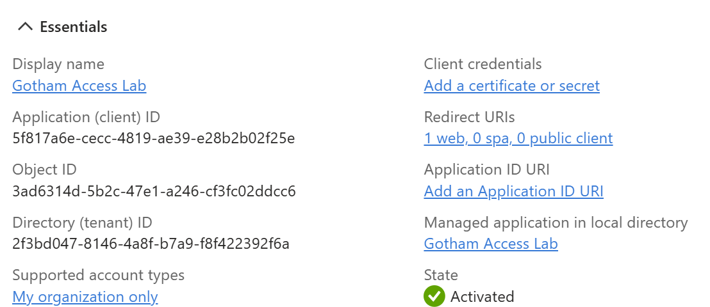

### 2. Review application roles

Verify the application defines the IT Reader and Procurement Reader roles.

Evidence:

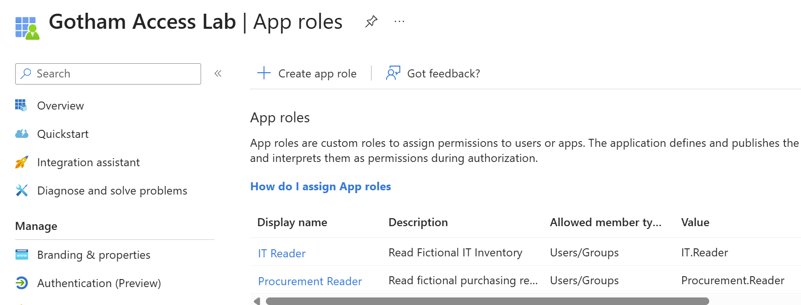

### 3. Review enterprise application assignments

Verify the reader security groups are assigned to the intended application roles and that the enterprise application requires assignment.

Evidence:

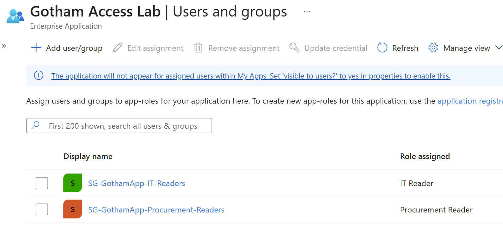

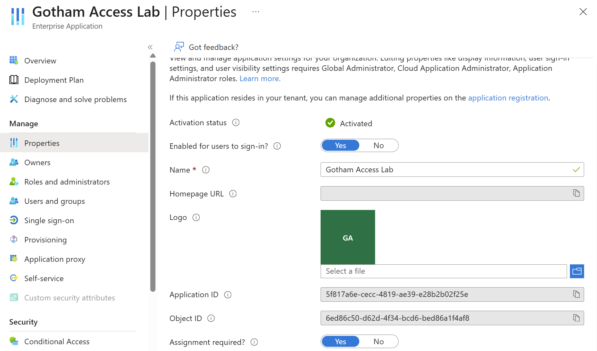

## Part 2: Administrator Consent Investigation

### 1. Capture the original approval problem

An earlier Tim Drake sign-in displayed an administrator-approval requirement. This screenshot documents the symptom; by itself it does not establish the exact cause or the date consent changed.

Evidence:

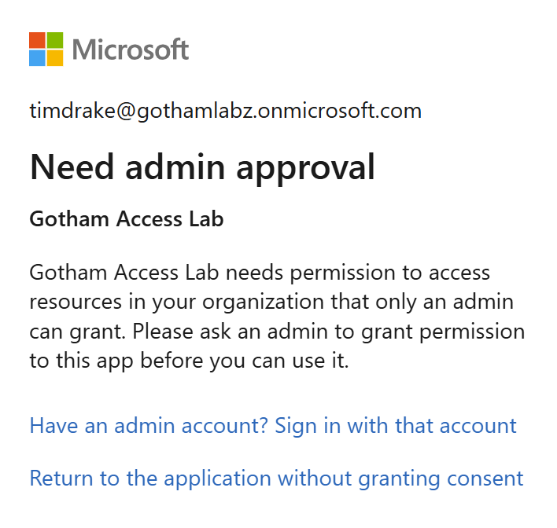

### 2. Inspect administrator consent

Under **Enterprise applications → Gotham Access Lab → Permissions**, the administrator-consent tab listed the delegated Microsoft Graph permission `User.Read` as granted by an administrator.

Evidence:

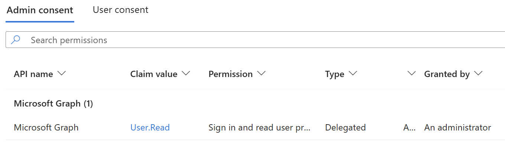

### 3. Review user consent

The User consent tab contained no user-consented permissions. This is not inherently a problem because consent can be granted on behalf of the organization.

Evidence:

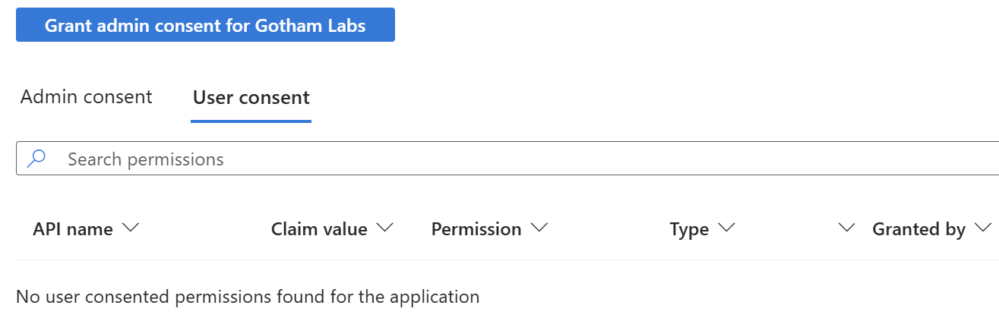

## Part 3: Application Visibility and Launch Troubleshooting

### 1. Verify application assignments and Tim's group membership

Enterprise applications showed the regular administrator and both reader groups assigned. Tim was **not directly assigned**, but was a member of `SG-GothamApp-Procurement-Readers` at this stage.

Evidence:

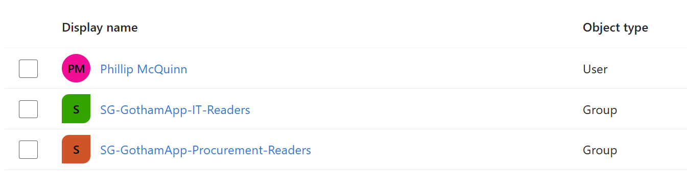

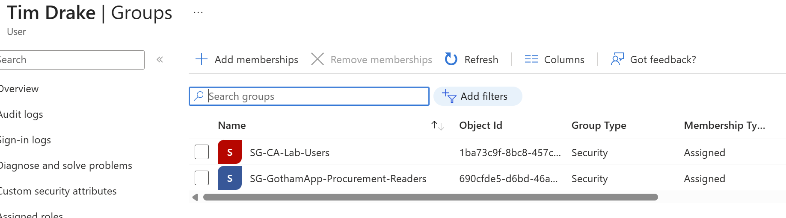

### 2. Diagnose missing My Apps tile

Gotham Access Lab did not initially appear in Tim's My Apps portal. The enterprise application properties showed:

- **Assignment required?** Yes
- **Visible to users?** No

Changed **Visible to users?** to **Yes**. Tim subsequently confirmed the application tile appeared in My Apps. That outcome was observed but no separate My Apps tile screenshot was provided.

Evidence:

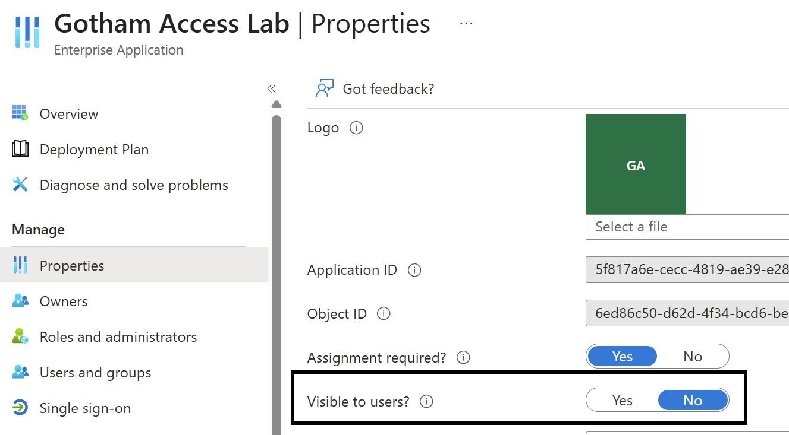

### 3. Investigate My Apps launch failure

Launching the newly visible tile resulted in **App launch failed**, with the application's ID and a correlation ID. This was distinct from authorization through the locally hosted Flask app.

The lab's local application was not installed on the workstation at the time of this test. A replacement local Flask application was prepared and configured using the existing Entra registration, redirect URI, and a valid client secret.

Evidence:

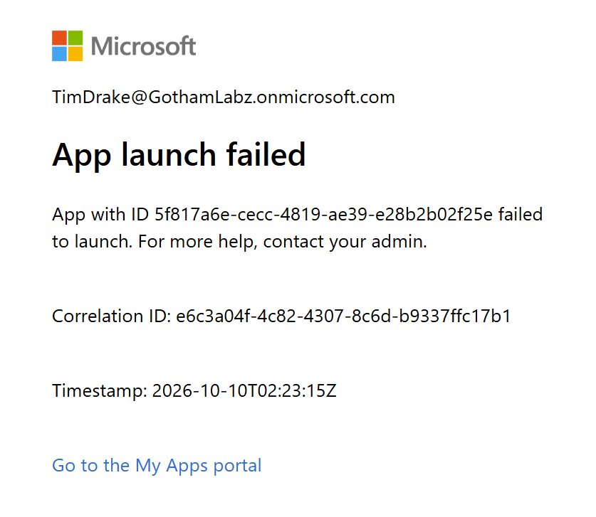

### 4. Test the local application

Started the local Flask application and successfully authenticated Tim Drake through Microsoft Entra ID.

Observed role claims:
- `Procurement.Reader`: Yes
- `IT.Reader`: No

Observed authorization:
- Procurement: Allowed
- IT Inventory: Denied

These application outcomes were reported during the live exercise, **without separate screenshots provided in this evidence package**.

## Part 4: Assignment Revocation and Session Behavior

### 1. Remove Procurement Readers membership

Remove Tim Drake from `SG-GothamApp-Procurement-Readers`, leaving his account enabled. Tim had no IT Reader group membership.

The group membership removal was confirmed during the exercise, but no post-removal membership screenshot was supplied here.

### 2. Compare existing and fresh sessions

After group removal, Tim reported that the **already authenticated local Flask session still permitted Procurement access**. This observation is documented as a reported result, not independently illustrated by an included image.

After signing out and attempting a fresh sign-in, Microsoft Entra returned **AADSTS50105**, stating the user was not directly assigned and was no longer a member of an assigned group.

Evidence:

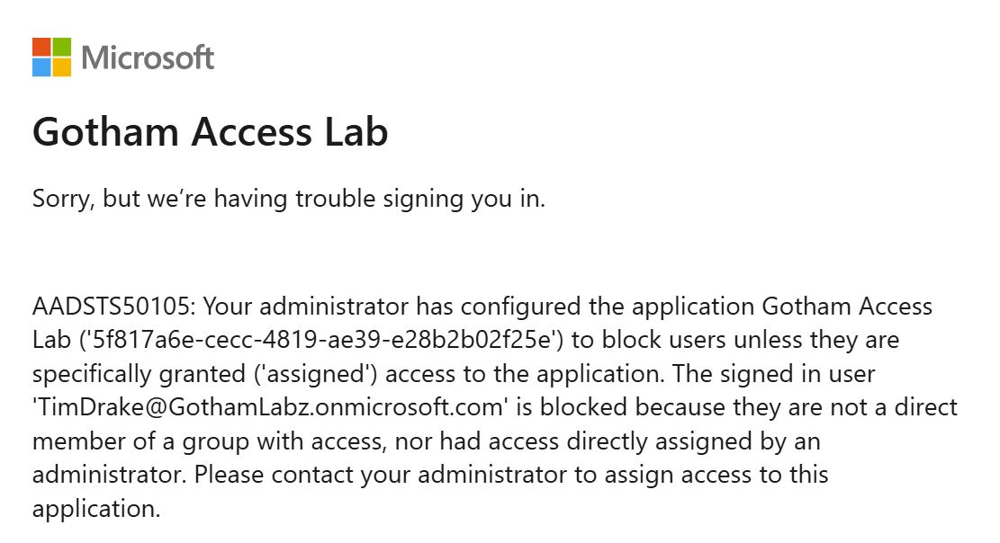

### 3. Verify the sign-in failure in Entra logs

The sign-in activity screenshot independently showed a **Failure** with error code **50105**. The clipped log screenshot does not show the application name, so it should be read together with the explicit on-screen 50105 error above.

Evidence:

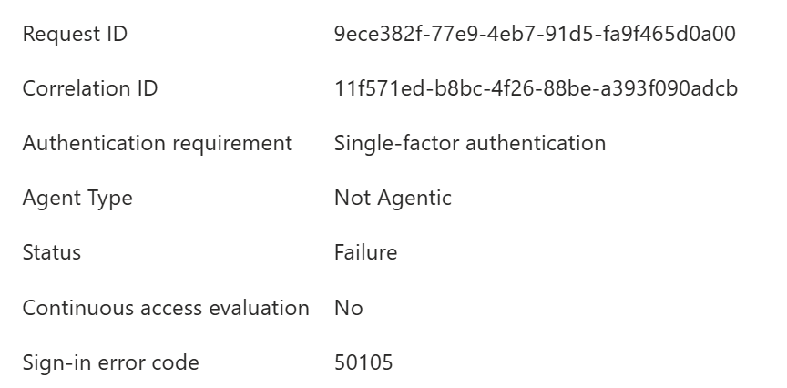

## Cleanup

Tim Drake was intentionally **left removed** from the Procurement Readers group, and was not added to the IT Readers group. His user account remained enabled.

The enterprise application remained configured to require assignment, and visibility remained enabled. The four enforced Conditional Access policies and two Report-only policies from Lab 07 were not changed during this exercise.

The restored local application's `.env` file and client secret must remain private and excluded from GitHub.

## Issues and Troubleshooting

| Symptom | Investigation | Resolution or result |
|---|---|---|
| Initial administrator approval prompt | Reviewed delegated Graph permission and consent tabs | `User.Read` had administrator consent when inspected; historical cause not conclusively established |
| Gotham Access Lab absent from My Apps | Inspected assignments, group membership, enterprise app properties | `Visible to users` was No; changed to Yes and tile appeared |
| My Apps tile failed to launch | Distinguished portal launch from local Flask-hosted application | Used restored local app at localhost instead; no verified My Apps launch correction |
| Existing session still had Procurement access | Tested after removing group membership | Existing Flask session retained access until sign-out |
| Fresh sign-in failed after removal | Reviewed Microsoft sign-in message and audit details | AADSTS50105 confirmed assignment-required denial |

## Lessons Learned

- **Application visibility and application authorization are separate controls.** A hidden My Apps tile does not prove that Entra has denied application access.
- **Admin consent and application assignment solve different problems.** An administrator-approved API permission does not assign individual users to an enterprise application.
- **Group-to-role assignment and role claims require end-to-end testing.** Procurement access succeeded while IT Inventory remained forbidden.
- **Removing access does not necessarily terminate an existing application session immediately.** The local Flask session continued authorizing its previously signed-in user until the sign-out and fresh authentication test.
- **AADSTS50105 demonstrates missing application assignment.** It is not, by itself, evidence that a user account has been disabled or that Conditional Access blocked authentication.
- **Evidence should distinguish screenshots from observed results.** Tests without independent screenshots remain explicitly documented as observations.
